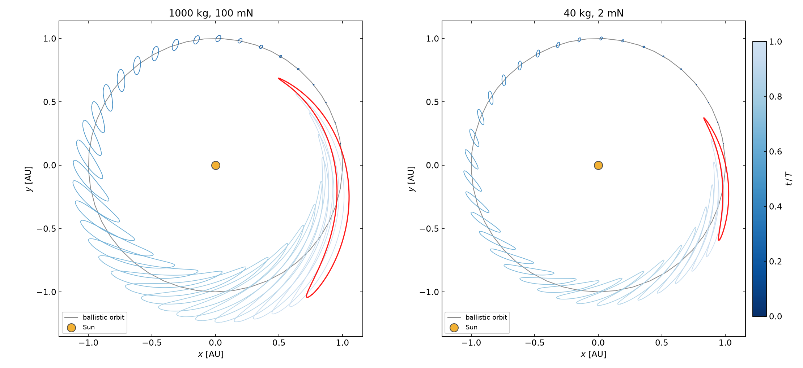
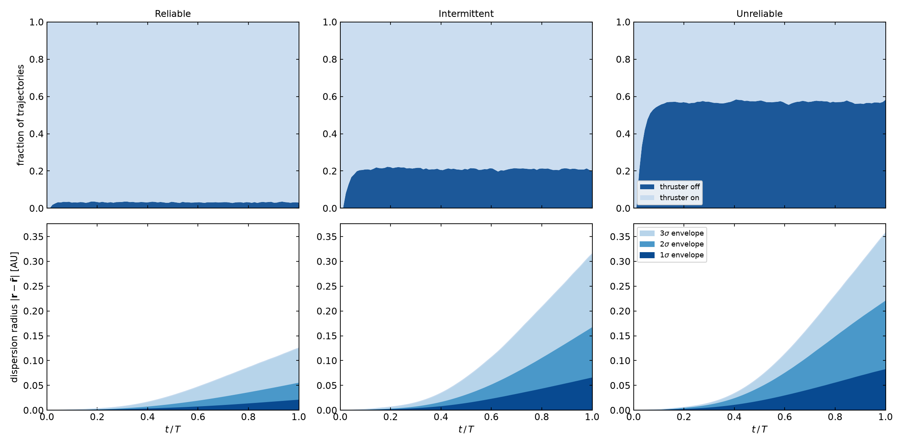

\newpage

# Introduction

Low-thrust electric propulsion has become the standard for a growing class of deep-space
and Earth-orbit missions. Its high specific impulse enables ambitious trajectories — but
its reliance on continuous, small accelerations makes it acutely sensitive to operational
anomalies: thruster outages, pointing errors, and magnitude uncertainties all degrade the
final state in ways that are expensive to correct.

This report develops two complementary analyses for a low-thrust heliocentric spacecraft,
both built on a common mathematical toolset — **Differential Algebra (DA)** and
**Automatic Domain Splitting (ADS)**:

1. **Reachability analysis.** Given a bounded thrust magnitude and arbitrary pointing
   direction, what region of the orbital plane is the spacecraft guaranteed to be able
   to reach at a given future time?  We compute the *reachability envelope* — the
   boundary of the set of all reachable positions — without sampling every possible
   thrust profile.

2. **Robustness analysis.** Given a nominal bang-bang plan subject to random
   thruster ON/OFF outages and small execution errors, what is the statistical
   spread of final states?  We propagate a probability distribution forward in time
   to obtain nested confidence bands at one, two, and three standard deviations.

Section 2 introduces the mathematical framework shared by both analyses.
Sections 3 and 4 present the reachability and robustness problems respectively,
with full problem formulations and results.  Section 5 summarises.

\newpage

# Mathematical Framework

## Taylor Series and Polynomial Arithmetic

The central idea of Differential Algebra is to replace ordinary floating-point
arithmetic with arithmetic on **truncated Taylor polynomials**, so that every
operation propagates not just a numerical value but its full partial-derivative
tensor up to a prescribed order $P$.

Let $\xi = (\xi_1, \ldots, \xi_M) \in \mathbb{R}^M$ denote $M$ uncertain
parameters.  A degree-$P$ Taylor expansion (TE) of a function $f : \mathbb{R}^M
\to \mathbb{R}$ around $\xi = 0$ is the truncated polynomial

$$
\mathcal{T}^P[f](\xi) \;=\; \sum_{|\alpha| \le P} c_\alpha\,\xi^\alpha,
\qquad c_\alpha = \frac{1}{\alpha!}\,\frac{\partial^{|\alpha|}f}{\partial\xi^\alpha}\bigg|_{\xi=0},
$$

where $\alpha \in \mathbb{N}^M$ is a multi-index and $|\alpha|=\alpha_1+\cdots+\alpha_M$.
The set of all such polynomials forms the **Taylor-expansion algebra** $\mathcal{D}^{P,M}$;
the four arithmetic operations and all elementary functions are defined on this ring by
composing and re-truncating power series to degree $P$.

The computational benefit is immediate: evaluating $f$ at any $\xi$ in the
neighbourhood costs only the evaluation of a polynomial (no new integrations),
and the derivative tensors $\partial^{|\alpha|}f/\partial\xi^\alpha$ are read
directly from the stored coefficients.

## The Flow Polynomial

Given an ODE $\dot{\mathbf{x}} = \mathbf{F}(\mathbf{x}, t)$ with initial condition
$\mathbf{x}(t_0) = \mathbf{x}_0(\xi)$ that depends on uncertain parameters, the
solution $\mathbf{x}(t; \xi)$ is approximated by integrating the ODE in
$\mathcal{D}^{P,M}$ arithmetic.

The result is the **flow polynomial**

$$
\boldsymbol{\Phi}_t(\xi) \;=\; \sum_{|\alpha| \le P} \mathbf{c}_\alpha(t)\,\xi^\alpha
\;\approx\; \mathbf{x}(t;\xi),
$$

a vector-valued Taylor polynomial in the uncertainty parameters.  All $P$-th order
partial derivatives of the trajectory with respect to $\xi$ are encoded in the
coefficient array $\{\mathbf{c}_\alpha\}$ and computed in a single integration pass.

The **zero-dynamics trick** is frequently used to incorporate slowly varying or
constant parameters: if $\xi_j$ is a parameter (not a true dynamical variable), it
is appended to the state with $\dot\xi_j = 0$.  The ODE dimension grows by the
number of uncertain parameters, but the parameters are then treated as ordinary
state components by the integrator.

### Flow map composition

When the force law changes abruptly at arc boundaries (as in bang-bang propulsion),
the trajectory is built arc by arc.  At the end of arc $k$ the polynomial
$\boldsymbol{\Phi}_{t_k}$ is passed as the initial condition for arc $k+1$.
The DA integrator then computes $\boldsymbol{\Phi}_{t_{k+1}} =
\boldsymbol{\Phi}_{t_k \to t_{k+1}} \circ \boldsymbol{\Phi}_{t_k}$ automatically
— the compositions of all per-arc maps accumulate into a single polynomial
relating initial uncertainties to the current position, to degree $P$, without any
re-integration.

## Automatic Domain Splitting (ADS)

Even high-degree Taylor polynomials lose accuracy when the true flow is strongly
nonlinear over the uncertainty domain.  **Automatic Domain Splitting** (Wittig 2015)
detects and cures this loss of accuracy by subdividing the domain adaptively.

### Truncation mass criterion

The approximation error of a degree-$P$ expansion is dominated by the neglected
degree-$(P+1)$ terms.  ADS uses the **truncation mass**

$$
\varepsilon_P \;=\; \sum_{|\alpha|=P} |c_\alpha|
$$

as a proxy.  When $\varepsilon_P > \tau$ (a user-defined tolerance), the expansion
is deemed insufficiently accurate and the domain is split.

### Split direction and bisection

The split is made along the parameter direction $j^*$ that carries the most
high-order weight:

$$
j^* \;=\; \arg\max_j \sum_{|\alpha|=P} |c_\alpha|\,\alpha_j.
$$

The domain is bisected along $j^*$, and two new Taylor expansions are initialised
— one on each half-domain — and propagated independently.  The process repeats
until every leaf satisfies $\varepsilon_P \le \tau$ or a maximum depth is reached.

### The ADS binary tree

The resulting data structure is a **binary tree** of *leaves*, each holding a
Taylor polynomial valid on its sub-box of the original uncertainty domain.
Taking the union of the leaf images gives the set approximation of the true flow;
the accuracy is controlled jointly by the polynomial degree $P$ and the tolerance $\tau$.

Figure 1 illustrates the difference between a single global Taylor polynomial
(left) and ADS (right) applied to the same initial condition box propagated
over one elliptic orbit.  The Taylor approximation maintains a single polygon
that grows and deforms; ADS automatically subdivides the domain into up to 15
leaves near the final epoch, where the nonlinearity of the flow is highest.
Each leaf is coloured by $t/T$.

## Nonlinearity Index and LOADS

An alternative splitting criterion, due to Losacco, Fossà, and Armellin (2024),
uses a coordinate-free measure of local nonlinearity rather than the truncation
mass.  The **Jacobian nonlinearity index** is

$$
\eta \;=\; \frac{\|\boldsymbol{\Phi} - J_1\boldsymbol{\Phi}\|}{
              \|J_1\boldsymbol{\Phi}\|},
$$

where $J_1\boldsymbol{\Phi}$ is the degree-1 (linear) part of $\boldsymbol{\Phi}$.
When $\eta > \tau$, the map is too nonlinear and the domain is split.  This
criterion, used in the **LOADS** algorithm, is more robust to large linear
deformations that inflate the truncation mass without degrading accuracy.

## Confidence Bands from a Particle Cloud

After propagation, the set of leaf evaluations (sampled on a fine grid within
each sub-box, or via Monte-Carlo) forms a particle cloud in state space.
The cloud is binned into a 2-D histogram, and **Highest Density Regions (HDRs)**
at prescribed coverage masses are extracted as contours of constant density.

The 2-D Gaussian-equivalent coverage masses used throughout this report are:

| Band | Coverage mass |
|------|--------------|
| $1\sigma$ | 39.35 % |
| $2\sigma$ | 86.47 % |
| $3\sigma$ | 98.89 % |

These match the 1-D Gaussian thresholds $P(|\mathcal{N}(0,1)|\le k)$ for $k=1,2,3$
and provide a natural yardstick for comparing cloud shapes across scenarios.

\newpage

# Reachability Analysis

## Problem Formulation

### Spacecraft model

The spacecraft moves in the **planar heliocentric two-body problem** in canonical
units ($\mu = 1$, $r_0 = 1$ AU, $v_0 = 1$ AU yr$^{-1}$, orbital period
$T = 2\pi \approx 1$ year).  The nominal orbit is the unit circle
$(x_0, y_0, \dot x_0, \dot y_0) = (1, 0, 0, 1)$.

The spacecraft can apply a bounded thrust acceleration.  The
**control variables** are:

- **Thrust magnitude** $m \in [0,\, a_{\max}]$, where $a_{\max}$ is the
  maximum specific acceleration;
- **Thrust direction** $\theta \in [0, 2\pi)$, the angle of the thrust
  vector relative to the prograde direction.

The equations of motion are

$$
\ddot x = -\frac{x}{r^3} + m(1+\delta_m)\,d_x,
\qquad
\ddot y = -\frac{y}{r^3} + m(1+\delta_m)\,d_y,
$$

where $r = (x^2 + y^2)^{1/2}$ and $(d_x, d_y) = R(\theta)\hat{\mathbf{v}}$
is the thrust direction rotated by $\theta$ from the prograde unit vector.

For the *reachability* problem the controls $(m, \theta)$ are treated as
**expansion variables**, not as uncertain parameters; the goal is to map
the entire control box $[0, a_{\max}] \times [0, 2\pi)$ through the flow.

### Zero-dynamics augmentation

Appending $(m, \theta)$ as additional state components with zero dynamics gives the
six-dimensional state $\mathbf{s} = (m, \theta, x, y, v_x, v_y)$, with
$\dot m = \dot\theta = 0$.  The DA integrator then represents the trajectory as a
polynomial in $(m, \theta)$.

### Two spacecraft

The analysis is repeated for two representative electric-propulsion missions:

| Case | Wet mass | Thrust | $a_{\max}$ |
|------|---------|--------|-----------|
| Spacecraft | 1 000 kg | 100 mN | $\approx 1.67\times10^{-4}$ (canonical) |
| CubeSat | 40 kg | 2 mN | $\approx 8.34\times10^{-5}$ (canonical) |

### ADS parameters

Both cases use polynomial degree $P = 6$ with $M = 2$ expansion variables.
The truncation-mass tolerance is $\tau = 10^{-5}$ and the maximum tree depth is 10.

## The Reachability Envelope

At any time $t$, the **reachability envelope** is the boundary of the set of all
positions reachable from the initial state under bounded thrust.  For fixed $t$,
evaluating the flow polynomial over the entire control box
$\{m \in [0, a_{\max}],\; \theta \in [0, 2\pi)\}$ yields a 2-D region
$\mathcal{R}(t)$.

The envelope is the image of the **maximum-thrust edge** $m = a_{\max}$,
$\theta \in [0, 2\pi)$:

$$
\partial\mathcal{R}(t) \;=\; \boldsymbol{\Phi}_t\!\left(a_{\max},\,
        \theta\right)_{\theta \in [0,2\pi)},
$$

i.e. the image of the circle of maximum thrust under the flow polynomial.
Each ADS leaf contributes one arc of this boundary; the full boundary is the
union of all leaf arcs.

## Results

Figure 2 shows the reachability envelopes at 16 equally spaced epochs over one
orbital period, for both spacecraft.  Successive envelopes are coloured from dark
to light blue ($t/T = 0 \to 1$); the final envelope is highlighted in red.

Several features stand out.  Early in the revolution (dark blue) the envelopes are
tight and nearly circular, because little time has elapsed and the accumulated thrust
effect is small.  As time grows the envelopes elongate along the orbit direction —
reflecting the strong leverage that prograde/retrograde thrust has on the semi-major
axis — and widen laterally through the cross-track and radial components.

The CubeSat envelopes are narrower than those of the larger spacecraft, scaling
roughly with $a_{\max}$.  Both envelopes reach roughly the same shape by
$t = T$, modulo this amplitude scaling; the topology is determined by the
two-body dynamics, not the thrust level.

The ADS tree expands to hundreds of leaves near the final epoch, capturing the
strong nonlinearity of the control-to-position map after a full revolution.
Each leaf holds a degree-6 polynomial that is accurate to within the tolerance;
the resulting piecewise-polynomial description provides a faithful, non-conservative
characterisation of the true reachable set.

\newpage

# Robustness Analysis

## Problem Formulation

### Nominal plan and uncertainty

The spacecraft follows a **bang-bang** thruster plan: at any instant the thruster
is either fully ON or fully OFF.  The nominal plan is continuous full thrust
at constant magnitude $m_{\text{nom}}$ in the prograde direction.

Two sources of uncertainty act simultaneously:

1. **Thruster outages** — the thruster may fail to fire at scheduled arcs,
   following a random Markov schedule (Section 4.1.3).
2. **Execution errors** — when the thruster is ON, the realised acceleration
   deviates from the commanded one by a random magnitude error $\delta_m$
   and pointing error $\delta_\theta$.

The combined acceleration on arc $k$ is

$$
\mathbf{a}_k \;=\; f_k\, m_{\text{nom}}\,(1+\delta_m)\,
    R(\theta_{\text{nom}}+\delta_\theta)\,\hat{\mathbf{v}},
$$

where $f_k \in \{0, 1\}$ is the binary ON/OFF state of arc $k$.

### Arc discretisation and execution errors

The revolution is divided into **91 arcs of 4 days each** (the minimum dwell time).
On each arc the realised acceleration is set once; the DA expansion variables encode
the two execution errors:

$$
\delta_m \;\sim\; \mathcal{U}[-2\%,+2\%], \qquad
\delta_\theta \;\sim\; \mathcal{U}[-5°,+5°].
$$

These are *fixed per trajectory* — they represent systematic biases of a particular
spacecraft unit, not noise — so the same error pair is applied to every ON arc of
one realisation.

### Two-state ON/OFF Markov chain

Whether each arc fires follows a **sticky two-state Markov chain** on
$\{\text{OFF}, \text{ON}\}$, transitioning once per arc:

$$
P \;=\;
\begin{pmatrix}
1 - p_{\text{recover}} & p_{\text{recover}} \\
p_{\text{fail}} & 1 - p_{\text{fail}}
\end{pmatrix},
$$

with $p_{\text{fail}} = P(\text{ON} \to \text{OFF})$ and
$p_{\text{recover}} = P(\text{OFF} \to \text{ON})$.
The chain starts ON; the stationary ON-duty fraction is

$$
\pi_{\text{ON}} \;=\; \frac{p_{\text{recover}}}{p_{\text{fail}} + p_{\text{recover}}}.
$$

Three scenarios span the range from a nearly perfect to a highly unreliable thruster:

| Scenario | $p_{\text{fail}}$ | $p_{\text{recover}}$ | Stationary ON duty |
|----------|-----------------|---------------------|-------------------|
| Reliable | 0.02 | 0.60 | $\approx$ 97 % |
| Intermittent | 0.08 | 0.30 | $\approx$ 79 % |
| Unreliable | 0.20 | 0.15 | $\approx$ 45 % |

### Equations of motion

Appending the two execution errors as zero-dynamics components gives the six-dimensional
state $\mathbf{s} = (\delta_m, \delta_\theta, x, y, v_x, v_y)$, with
$\dot\delta_m = \dot\delta_\theta = 0$.  The equations of motion are

$$
\dot x = v_x,\quad \dot y = v_y,\quad
\dot v_x = -\frac{x}{r^3} + f_k\,m_{\text{nom}}(1+\delta_m)\,d_x,\quad
\dot v_y = -\frac{y}{r^3} + f_k\,m_{\text{nom}}(1+\delta_m)\,d_y.
$$

On an OFF arc ($f_k = 0$) the thrust term vanishes and the motion is pure
Keplerian.

## Method: DA Surrogate with Monte-Carlo Scheduling

The two execution errors $(\delta_m, \delta_\theta)$ are the DA expansion variables;
they define a small uncertainty box that is seeded once and propagated arc by arc.

For each Monte-Carlo sample the procedure is:

1. Draw a random ON/OFF schedule $\{f_k\}_{k=0}^{90}$ from the Markov chain.
2. Seed the DA state at the nominal initial condition.
3. Propagate arc by arc: on each arc, set the thrust magnitude to
   $m_{\text{nom}} f_k$ (or 0 if OFF) and integrate the DA ODE over the arc.
   The DA state at the end of arc $k$ is carried directly as the initial condition
   for arc $k+1$, automatically composing all per-arc flow maps.
4. After each arc, evaluate the degree-6 position polynomial at 16 random
   draws of $(\delta_m, \delta_\theta)$ and bin the resulting positions into a
   $130 \times 130$ 2-D histogram.

With 8 000 Monte-Carlo schedules and 16 draws each, every 4-day snapshot accumulates
$\approx 128\,000$ position samples.  The surrogate cost is dominated by the 8 000
integrations (one per schedule), each of $O(91 \times \dim\mathcal{D}^{6,2})$ DA
operations; the 16-point polynomial evaluation per arc is negligible by comparison.

Confidence bands are then extracted from the histogram as Highest Density Regions
at the 2-D Gaussian-equivalent coverage masses described in Section 2.4.

## Results

### Dispersion growth over one revolution

Figure 3 shows the $3\sigma$ dispersion boundary at every 4-day snapshot, for all
three scenarios.  Each curve is coloured by $t/T$; the final boundary is red.

The dispersion ellipses trail the spacecraft like beads strung along the orbit,
growing monotonically as more missed-thrust offsets accumulate.  The key trend is
the **mean track**: as reliability drops, the cloud mean migrates from the nominal
(dark blue dashed) orbit toward the ballistic (grey) orbit.  This reflects
increasingly long total OFF time — the unreliable spacecraft fires only $\approx 45\%$
of arcs, so its mean trajectory resembles a slightly perturbed ballistic orbit
rather than a thrusting one.

The beads in the reliable case are closely clustered near the nominal orbit;
those in the unreliable case are far wider and reach significantly higher up the
orbit.  At any given epoch the uncertainty in the realized duty cycle dominates
the uncertainty from execution errors.

### Final-epoch dispersion: nested $1/2/3\sigma$ bands

Figure 4 zooms into the neighbourhood of $t = T$ to show the nested
$1\sigma$, $2\sigma$, and $3\sigma$ HDR bands at the final epoch.

In the reliable case the $1\sigma$ band tightly encloses the nominal endpoint and
the $3\sigma$ band is only modestly wider — execution errors dominate the spread
here.  As reliability decreases, two effects compound: the bands **grow in area**
(more variance in duty cycle) and the **mean migrates toward the ballistic
endpoint** (less total impulse on average).

In the unreliable scenario the cloud mean lies roughly midway between the two
reference orbits, and the $3\sigma$ band spans nearly the entire arc between them.
Any corrective manoeuvre must account for this broad, asymmetric distribution.

### Duty cycle and dispersion radius vs. time

Figure 5 summarises the time evolution for each scenario in two rows:

- **Top row:** the fraction of trajectories with the thruster ON (dark blue) and
  OFF (light blue) at each snapshot epoch.
- **Bottom row:** the radial dispersion envelopes at $1\sigma$, $2\sigma$, $3\sigma$
  as a function of $t/T$.

The duty-cycle panels (top row) show the Markov chain relaxing from its all-ON start
toward the stationary duty fraction.  The reliable chain reaches $\approx 97\%$ ON
almost immediately and stays there; the intermittent one settles to $\approx 79\%$
within a few weeks; the unreliable one takes several arcs to fall to $\approx 45\%$
and continues to fluctuate.

The radial dispersion panels (bottom row) reveal near-monotone, accelerating growth:
missed-arc offsets accumulate without cancellation, since each OFF arc delivers
a fixed impulse deficit that is never recovered.  The final $3\sigma$ dispersion
radius is approximately:

| Scenario | $3\sigma$ radius at $t = T$ |
|----------|---------------------------|
| Reliable | $\approx 0.12$ AU |
| Intermittent | $\approx 0.24$ AU |
| Unreliable | $\approx 0.36$ AU |

The dispersion grows roughly linearly in the number of expected missed arcs,
reflecting the dominant role of the duty-cycle variance over the smaller execution-error
contribution.

\newpage

# Summary

This report has demonstrated the use of Differential Algebra and Automatic Domain
Splitting for two distinct but complementary mission-analysis tasks.

**Reachability** casts the thrust control variables as DA expansion variables,
propagating the full $(m, \theta)$ control box through the orbital dynamics in a
single integration.  ADS subdivides the control domain wherever the flow becomes
too nonlinear, producing a piecewise-polynomial map from control space to position
space.  The reachability envelope — the boundary of the achievable position set at a
given time — is then read off as the image of the maximum-thrust curve under this map.
For both the 1 000 kg spacecraft and the 40 kg CubeSat the envelope evolves from a
compact disk near the initial position to an elongated, orbit-following region after
a full revolution, scaling in amplitude with $a_{\max}$ while preserving the same
topology.

**Robustness** uses DA to build a polynomial surrogate for the sensitivity of the
trajectory to execution errors, and Monte-Carlo sampling to propagate a random
ON/OFF thruster schedule.  Carrying the DA polynomial across arc boundaries
automatically composes all per-arc flow maps, so the position at any snapshot is a
degree-6 polynomial in the two execution errors, valid over the full uncertainty
box.  Evaluating this polynomial at random error draws is far cheaper than
re-integrating the ODE, enabling $\approx 128\,000$ histogram samples per epoch
from 8 000 Monte-Carlo integrations.  The resulting dispersion bands quantify
both the growth of positional uncertainty over one revolution and the strong
dependence on thruster reliability: the $3\sigma$ dispersion radius at $t=T$
grows from $0.12$ AU for a nearly perfect thruster to $0.36$ AU for an unreliable
one.

Together, the two analyses provide a complete probabilistic picture of the mission:
the reachability envelope defines *what can be achieved* under nominal authority,
while the robustness bands define *how reliably it can be achieved* under realistic
failure modes.

\newpage

# References

1. **Berz, M.** (1999). *Modern Map Methods in Particle Beam Physics*.
   Academic Press. — Foundational text on Differential Algebra for dynamical
   systems.

2. **Wittig, A., Di Lizia, P., Armellin, R., Makino, K., Bernelli-Zazzera, F.,
   and Berz, M.** (2015). Propagation of large uncertainty sets in orbital
   mechanics by automatic domain splitting. *Celestial Mechanics and Dynamical
   Astronomy*, 122(3), 239–261. — Introduces ADS and the truncation-mass
   splitting criterion.

3. **Losacco, M., Fossà, A., and Armellin, R.** (2024). LOADS: a local
   orbital dynamics splitting method for uncertainty propagation. *Celestial
   Mechanics and Dynamical Astronomy*, 136(1), 9. — Introduces the Jacobian
   nonlinearity index and the LOADS splitting criterion.

4. **Verner, J. H.** (2010). Numerically optimal Runge–Kutta pairs with
   interpolants. *Numerical Algorithms*, 53(2), 383–396. — Source of the
   Verner 8(9) embedded RK pair used for all propagations.

5. **Hyndman, R. J.** (1996). Computing and graphing highest density regions.
   *The American Statistician*, 50(2), 120–126. — HDR definition and
   computation used for the confidence bands.
