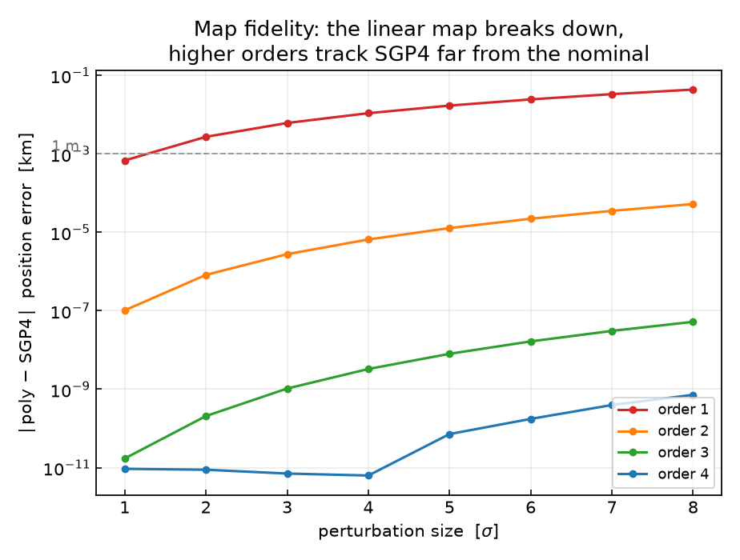
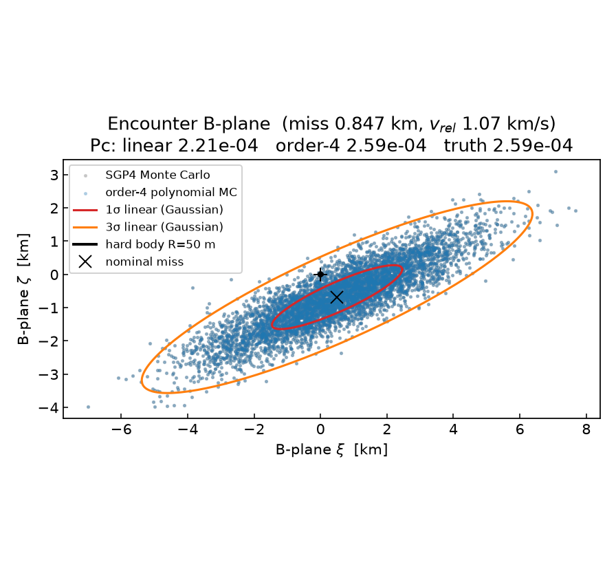

# Collision Probability with a Taylor-expanded SGP4

This tutorial works a classic **Space-Situational-Awareness (SSA)** problem —
estimating the **probability of collision** (\(P_c\)) between two catalogued
objects — and shows what the Taylor-expansion machinery in `tax` adds once SGP4
is templated on the scalar type.

The full program is
[`examples/conjunction/collision_probability.cpp`](https://github.com/andreapasquale94/tax-flow/tree/main/examples/conjunction/collision_probability.cpp);
build it with `-DTAXFLOW_BUILD_EXAMPLES=ON` and run `./conjunction_pc`.

## The idea

SGP4 turns a TLE's mean elements into a Cartesian state. The catalogue entry is
not exact, so the propagated state carries an uncertainty. With the propagator
templated on the scalar `T`, we seed the six mean elements as **identity Taylor
expansions**

\[
i = i_0 + \delta i,\quad \Omega = \Omega_0 + \delta\Omega,\;\dots
\]

and one SGP4 run returns the *entire local map*

\[
\mathbf r(t),\,\mathbf v(t) \;=\; \mathcal P\!\left(\delta i,\delta\Omega,\delta e,\delta\omega,\delta M,\delta n\right)
\]

as a polynomial of the chosen order in the element deviations. In `tax-flow`
this is just:

```cpp
using TE = tax::TaylorExpansion<double, tax::IsotropicScheme</*order=*/4, /*vars=*/6>>;
Seeds<TE> seeds{ TE(tle.bstar), TE(tle.ndot), TE(tle.nddot),
                 TE::variable(tle.inclo, 0), TE::variable(tle.nodeo, 1), TE::variable(tle.ecco, 2),
                 TE::variable(tle.argpo, 3), TE::variable(tle.mo, 4),    TE::variable(tle.no_kozai, 5) };
Satellite<TE> sat(tle, GravModel::Wgs72, seeds);
State<TE> s = sat.propagate(tca_minutes);   // s.r(c), s.v(c) are polynomials
```

From that one object we get, for free and exactly:

* the **Jacobian** `s.r(c).gradient()` — the state-transition map, no finite
  differencing — which maps the initial covariance \(C_0\) to the encounter:
  \(C = J\,C_0\,J^\top\) (the classical linearised, STM-based \(P_c\));
* the **higher-order terms**, which let us evaluate the propagated state for any
  element deviation by just **evaluating the polynomial** — no second SGP4 run.

## The scenario

The primary is the canonical ISS TLE; the secondary is a crossing orbit tilted
8° in inclination whose RAAN is tuned so the two pass within ~0.85 km at the
ascending node, ~21 min after epoch, closing at ~1.07 km/s. Each object is given
a TLE-class \(1\sigma\) element uncertainty, producing a roughly km-scale
position footprint at the encounter.

The collision probability is the standard short-term-encounter **2-D \(P_c\)**:
project the combined position uncertainty and the miss vector onto the B-plane
(the plane perpendicular to the relative velocity) and integrate the resulting
2-D Gaussian over the combined hard-body disk (here \(R = 50\) m).

## Why higher order — the map-fidelity test

Before computing \(P_c\), the example walks outward along the
"all-elements-at-\(+k\sigma\)" direction and reports how far each truncation
order of the map drifts from a fresh SGP4 run:



```
  k-sigma     order1      order2      order3      order4
   1        6.758e-04   1.021e-07   1.712e-11   9.307e-12
   2        2.703e-03   8.172e-07   2.063e-10   8.841e-12
   4        1.081e-02   6.538e-06   3.265e-09   6.287e-12
   8        4.326e-02   5.231e-05   5.207e-08   7.169e-10   [km]
```

The **linear** map's error grows quadratically — 0.7 m at \(1\sigma\), but
**43 m at \(8\sigma\)**, comparable to the hard-body radius. Each extra order
adds a power of \(k\): the order-4 map stays at **sub-millimetre** accuracy out
to \(8\sigma\). This is the noise-free signature of *when* the linearisation is
no longer enough — large initial uncertainty, long propagation arcs, or
eccentric / deep-space dynamics where the SGP4 flow curves strongly.

## The collision probability

```
Collision probability (hard-body radius 50 m):
  analytic linear  (J C0 J^T, Gaussian)   Pc = 2.21e-04
  polynomial MC, order 1  (1e6 samples)   Pc = 2.59e-04
  polynomial MC, order 4  (1e6 samples)   Pc = 2.59e-04
  brute-force SGP4 MC     (1e6 samples)   Pc = 2.59e-04   (truth)
```

Running all three estimators on the **same** million samples:

* the **order-4 polynomial Monte Carlo** matches the brute-force SGP4 Monte
  Carlo to the displayed precision — the polynomial *is* SGP4 here, but every
  sample is a polynomial evaluation rather than a re-propagation;
* the **analytic linear (Gaussian)** \(P_c\) reads ~15 % lower (2.21 vs
  2.59 \(\times 10^{-4}\)): that gap is the **non-Gaussianity** of the true
  encounter distribution, which the Gaussian formula cannot see but the
  polynomial map captures. For tail encounters (miss at several \(\sigma\)) or
  longer arcs the gap widens, which is exactly where an under-estimated \(P_c\)
  is dangerous.



The B-plane figure shows the SGP4 and order-4 polynomial clouds lying on top of
one another inside the linear \(1\sigma\)/\(3\sigma\) ellipses, with the nominal
miss (×) just inside \(1\sigma\) and the 50 m hard body at the centre (too small
to resolve at this scale — as it should be).

## Takeaways

* **One propagation, the whole local map.** Templating SGP4 on the scalar gives
  the Jacobian (exact STM / linear \(P_c\)) and the higher-order terms from a
  single run — no finite differences, no re-propagation per sample.
* **Higher order = validity far from the nominal.** The fidelity table
  quantifies where the linearisation fails; the order-\(N\) map and its
  polynomial Monte Carlo give the rigorous non-Gaussian \(P_c\) precisely in the
  regimes (large covariance, long lead time, eccentric/deep-space, tail events)
  where the linear/Gaussian answer is wrong.
* **A reusable surrogate.** Once built, the map evaluates the state for any
  sample or scenario, enabling fast nonlinear covariance propagation,
  sensitivity analysis and screening.

A note on realism: this example assumes a diagonal element covariance. In
practice a TLE covariance is commonly recovered by taking a *pair* of TLEs
separated in time and propagating the older one with SGP4 to the newer epoch —
the same `tax::sgp4` propagator, now used to *calibrate* \(C_0\).

## Further reading

The differential-algebra approach to conjunctions and collision probability —
Taylor expansion of the time and distance of closest approach, polynomial /
ADS-based Monte Carlo for \(P_c\), and nonlinear covariance propagation — is
developed in, among others:

* M. Morselli, R. Armellin, P. Di Lizia, F. Bernelli-Zazzera,
  ["Rigorous Computation of Orbital Conjunctions"](https://www.researchgate.net/publication/256839784_Rigorous_Computation_of_Orbital_Conjunctions),
  *Advances in Space Research*, 2014.
* A. Morselli et al.,
  ["Computing Collision Probability using Differential Algebra and Advanced Monte Carlo Methods"](https://www.researchgate.net/publication/256839705_Computing_Collision_Probability_using_Differential_Algebra_and_Advanced_Monte_Carlo_Methods).
* J. M. Aristoff et al. and related work on
  ["Probability of collision in nonlinear dynamics by moment propagation"](https://arxiv.org/pdf/2504.13935) and
  ["polynomial-based Monte Carlo for \(P_c\)"](https://arxiv.org/pdf/2509.07607).
* G. Acciarini et al.,
  ["Closing the Gap Between SGP4 and High-Precision Propagation via Differentiable Programming"](https://arxiv.org/html/2402.04830v4),
  *Acta Astronautica*, 2024 — a differentiable SGP4 in the same spirit as the
  Taylor-templated propagator used here.
