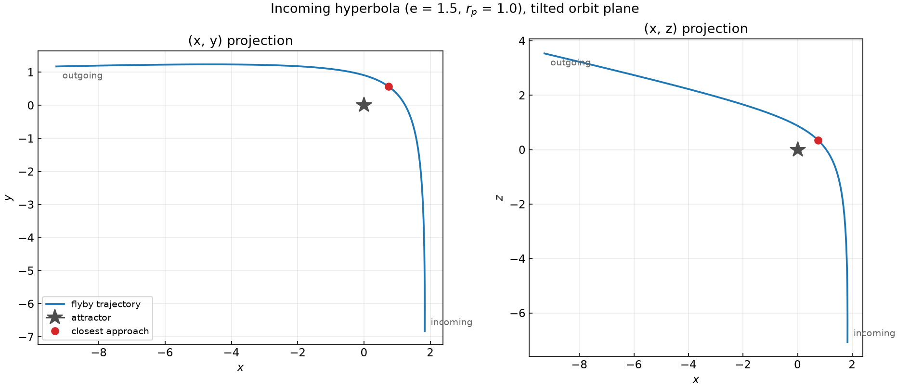
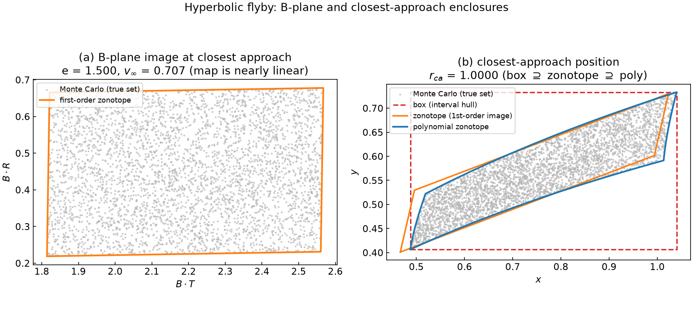
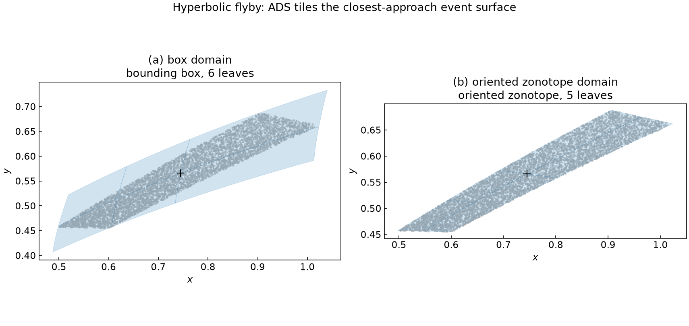
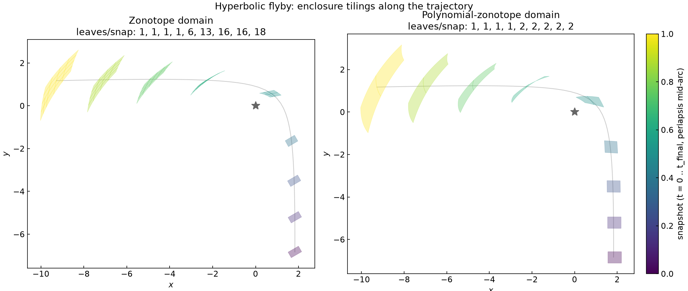

# Hyperbolic flyby and the B-plane

This tutorial takes an **incoming hyperbola** in the normalized two-body
problem and asks three questions a flyby analyst cares about:

1. *When* is closest approach, as a function of the initial uncertainty — the
   **Taylor expansion of the event**;
2. *What* is the state there — the **Taylor expansion of the state at the
   event**;
3. *Where* does the trajectory cross the **B-plane** (the aiming plane
   perpendicular to the incoming asymptote), and how do we **enclose** that
   crossing with a box, a zonotope, and a polynomial zonotope.

We answer them first with a **single Taylor flow map** (no splitting — the
simplest case), then let **Automatic Domain Splitting** act and watch the
event surface get found *piecewise*, one leaf at a time.

Source: [`examples/hyperbola/`](https://github.com/andreapasquale94/tax/tree/main/examples/hyperbola)
— `bplane_taylor.cpp`, `bplane_ads.cpp`, `snapshots.cpp`.

## The problem

The spatial (3-D) two-body problem in canonical units (\(GM = 1\)), state
\(\mathbf{s} = (\mathbf{r}, \mathbf{v})\):

$$
\dot{\mathbf{r}} = \mathbf{v}, \qquad
\dot{\mathbf{v}} = -\frac{\mathbf{r}}{r^3}, \qquad r = \lVert \mathbf{r} \rVert .
$$

Unlike the planar [two-body tutorial](two_body.md) we keep all three spatial
dimensions, so the flyby has a genuine B-plane. The reference orbit is an
incoming hyperbola with eccentricity \(e = 1.5\) and periapsis radius
\(r_p = 1\), tilted out of the \(x\)-\(y\) plane by
\((i, \omega, \Omega) = (45^\circ, 30^\circ, 15^\circ)\). The initial condition
sits on the incoming asymptote at true anomaly \(\nu_0 = -120^\circ\); the
integration runs symmetrically through periapsis to the outgoing leg. The
same generic `rhs()` lambda serves `double` and `TaylorExpansion` states.

The uncertainty is a 2-D transverse **position dispersion** in the inertial
\((x, y)\) plane at the incoming epoch — an oriented rectangle (a `Zonotope`),
its axis-aligned bounding `Box`, and a gently curved `PolynomialZonotope`.



The trajectory comes in along the lower asymptote, swings around the attractor
at closest approach (red), and leaves along the upper asymptote; the \((x, z)\)
panel shows the orbit is genuinely out of the \(x\)-\(y\) plane.

## Closest approach as an event

Closest approach is the increasing zero-crossing of the radial velocity
\(g(\mathbf{s}) = \mathbf{r}\cdot\mathbf{v}\) (negative on approach, zero at
periapsis, positive on departure). Because the state is DA-valued, the event
predicate reduces the state to its **constant term** so it returns a plain
`double` — the root finder then brackets on the *center* orbit:

```cpp
inline auto radialVelocityOfCenter() {
    return []( const auto& x, double ) -> double {
        return x(0)[0]*x(3)[0] + x(1)[0]*x(4)[0] + x(2)[0]*x(5)[0];
    };
}
```

Handed to `tax::ode::propagate` as a `RootFindingEvent`, this records the DA
state at the located time \(t^\*\) — already the **Taylor expansion of the
state at the event** (at the nominal event time):

```cpp
std::vector<std::shared_ptr<tax::ode::Event<DAState,double>>> events;
events.push_back(std::make_shared<tax::ode::RootFindingEvent<DAState,double,G>>(
    radialVelocityOfCenter(), tax::ode::Direction::Increasing, "closest_approach"));
auto sol = tax::ode::propagate(Verner89{}, rhs(), x0_da, 0.0, t_final, cfg, events);
```

### Finding the event *surface*

For \(\xi \ne 0\) the true closest approach happens at a slightly *different*
time than the center's \(t^\*\). The set of those times is the event surface
\(t^\*(\xi)\). We recover it with **one DA-Newton step** on \(g = 0\): with
\(g' = \tfrac{d}{dt}(\mathbf{r}\cdot\mathbf{v}) = v^2 - 1/r\),

$$
\Delta t(\xi) = -\frac{g(\xi)}{g'(\xi)},
\qquad
X_{ca}(\xi) = X(t^\*, \xi) + f\big(X(t^\*,\xi)\big)\,\Delta t(\xi),
$$

a single DA division and a step along the vector field:

```cpp
const TE g    = rdotv(X_star);
const TE gdot = v2 - TE(1.0) / r_star;   // v^2 - 1/r
const TE dt   = -g / gdot;               // dt(xi), constant term ~ 0
const DAState f = rhs()(X_star, t_event);
for (int i = 0; i < D; ++i) X_ca(i) = X_star(i) + f(i) * dt;
```

The residual \(\lvert \mathbf{r}\cdot\mathbf{v}\rvert\) evaluated on
\(X_{ca}\) drops by orders of magnitude versus \(X(t^\*,\cdot)\) — the example
prints both, confirming the surface was located. The closest-approach
*distance* polynomial is then simply \(r_{ca}(\xi) = \lVert
\mathbf{r}(X_{ca})\rVert\), whose constant term recovers \(r_p\).

## The B-plane representation

Every B-plane quantity is a Kepler orbit invariant, so `bData()` computes them
generic over the scalar type — `double` for the nominal frame, `TaylorExpansion`
for the map. From \(X_{ca}\) we build the eccentricity vector, angular
momentum, the incoming asymptote unit vector
\(\hat{S} = (\hat{e} + \sqrt{e^2-1}\,\hat{p})/e\), and the impact-parameter
vector \(\mathbf{B}\) of magnitude \(b = h / v_\infty\). Projecting
\(\mathbf{B}(\xi)\) onto the **fixed nominal frame**
\((\hat{T}, \hat{R})\) gives two DA polynomials \(B{\cdot}T(\xi)\) and
\(B{\cdot}R(\xi)\) — the B-plane image of the IC set (panel (a) below).



For a flyby the impact parameter is a nearly **linear** function of the initial
condition, so the B-plane image (panel (a)) is a clean parallelogram — a
first-order **zonotope** already encloses it tightly. You do not need domain
splitting for the B-plane itself.

## Enclosing the closest-approach set

The genuine nonlinearity of the flyby is in **configuration space** near
periapsis (gravitational focusing bends the set into a banana). So the
box / zonotope / polynomial-zonotope hierarchy is most telling on the
closest-approach **position** \((x, y)\) of \(X_{ca}\) (panel (b) above),
exactly the [set-representation hierarchy](../ads/zonotope.md):

- **box** — the interval hull \(c_0 \pm \sum_{\alpha\neq 0}\lvert c_\alpha
  \rvert\), a rigorous but loose axis-aligned enclosure;
- **zonotope** — the first-order image \(c + J\xi\) (a parallelogram); it
  tracks the set but overshoots at the curved tips — a linear image is *not*
  an enclosure on its own;
- **polynomial zonotope** — the full DA outline, hugging the true set; this is
  the curved set the library carries as a leaf payload.

A 5000-sample Monte-Carlo cloud validates the enclosures. `bplane_taylor.cpp`
writes `hyperbola_bplane.json`.

## ADS: the event surface, one leaf at a time

A single flow map loses accuracy near periapsis, the most nonlinear part of
the flyby. With ADS acting, each leaf finds the closest approach of its *own*
sub-region's center orbit — the event surface is tiled piecewise.

The key is a **terminal** \(\mathbf{r}\cdot\mathbf{v}\) event. The driver runs
user events before its internal `SplitEvent`, so a leaf reaching periapsis
terminates there (capturing its flow map at closest approach) instead of
splitting; splits therefore happen strictly on the approach leg. Every `done`
leaf's payload is thus its closest-approach flow map, and the done leaves tile
the whole IC set at the event. Because `tax::ads::propagate<P>` does not
forward user events, we drive an `AdsDriver` directly:

```cpp
using Stepper = tax::ode::StepperType<Verner89, DAState>;
tax::ads::AdsDriver<Stepper, tax::ads::TruncationCriterion, Domain> driver{
    criterion, cfg, periapsisEvent(), num_threads };  // terminal event in the extras
auto sol = driver.run(rhs(), domain, icCenter(), 0.0, t_final);

for (int li : sol.tree().done()) {
    const auto& leaf = sol.tree().leaf(li);   // leaf.payload = closest-approach flow map
    // evaluate leaf.payload's (x, y) over its cube -> this leaf's event-surface tile
}
```

`bplane_ads.cpp` runs the same oriented uncertainty as its bounding `Box` and
as the oriented `Zonotope`, tiling the closest-approach positions of each:



Both tile the event surface into a handful of leaves, each carrying its
sub-region's closest-approach flow map. The **oriented zonotope** (b) wraps the
correlated set tightly; the axis-aligned **box** (a) must cover the same set
with leaves that spill well beyond it — the same "oriented domains fit
anisotropic sets better" lesson as the [zonotope tutorial](../ads/zonotope.md).

## Enclosure snapshots along the trajectory

`snapshots.cpp` propagates the `Zonotope` and `PolynomialZonotope` IC sets with
a snapshot grid and records the leaf partition at nine times along the flyby.



The enclosure sweeps around the attractor, stretching into a banana as it goes.
The **zonotope** domain (left) refines into many leaves as the flow stretches
through periapsis; the **polynomial-zonotope** domain (right) carries the
curvature in its payload and needs only one or two leaves for the same set. The
polynomial zonotope is propagated single-threaded (the parallel driver can be
memory-heavy on large curved DA states) and never merged (it models `Domain`
but not `LocatableDomain`).

## Run it yourself

```bash
cmake -S . -B build -DTAXFLOW_BUILD_EXAMPLES=ON && cmake --build build -j
cd build/examples
./hyperbola_bplane_taylor && ./hyperbola_bplane_ads && ./hyperbola_snapshots
python3 ../../examples/plot/plot_hyperbola_bplane.py    --data . --out figs
python3 ../../examples/plot/plot_hyperbola_snapshots.py --data . --out figs
```

Things to try:

- **Grow the dispersion** (`kIcHalfA`, `kIcHalfB` in
  `examples/hyperbola/common.hpp`) and watch the closest-approach set curve away
  from its linear (zonotope) approximation, and the ADS leaf count rise.
- **Change the geometry** (`kEcc`, `kNu0`, `kInc`) — a slower flyby (smaller
  \(e\)) bends more and needs more leaves.
- **Add a second DA-Newton step** to the time-of-event correction and watch the
  residual \(\lvert\mathbf{r}\cdot\mathbf{v}\rvert\) shrink further.
