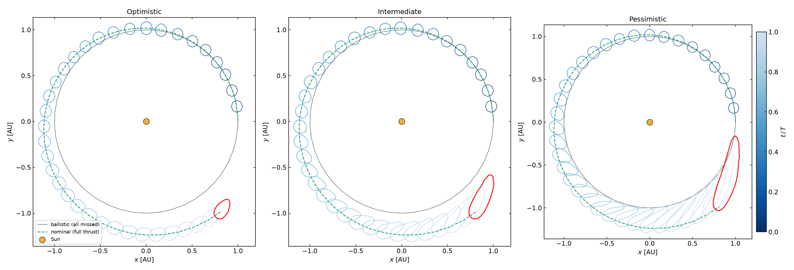
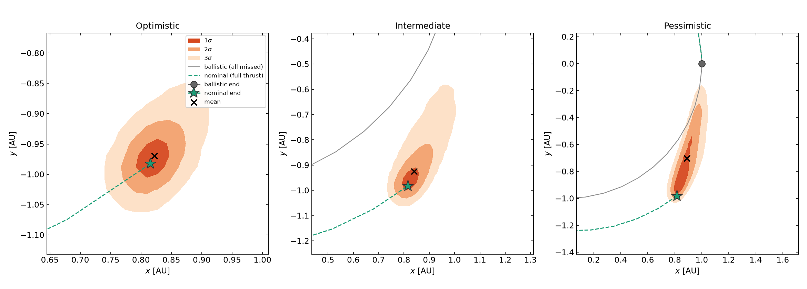
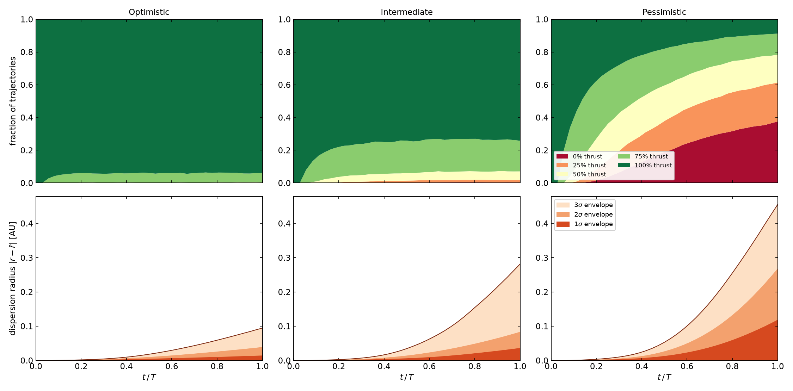

# Missed-thrust dispersion under a Markov chain

A low-thrust spacecraft rarely delivers exactly what the flight software
commands. This tutorial builds the **missed-thrust dispersion set** — the
region in the orbital plane that the spacecraft may occupy after one
heliocentric revolution — when the delivered thrust fraction follows a
five-state **Markov chain** over \(\{0,\,25,\,50,\,75,\,100\}\%\) and every
manoeuvre additionally carries small **execution errors** in magnitude and
pointing. Three scenarios bracket the risk: optimistic (rare, brief outages)
through pessimistic (frequent, slow-to-recover degradation).

Source: [`examples/missed_thrust/`](https://github.com/andreapasquale94/tax-flow/tree/main/examples/missed_thrust)
— `common.hpp`, `missed_thrust.cpp`, `plot.py`.

---

## Problem formulation

### Orbit and nominal thrust plan

The spacecraft moves in the planar heliocentric two-body problem in canonical
units (\(\mu = 1\), \(r_0 = 1\,\mathrm{AU}\), circular speed \(v_0 = 1\),
period \(T = 2\pi\)). Starting on a circular orbit
\((x_0, y_0, \dot x_0, \dot y_0) = (1, 0, 0, 1)\), the mission applies a
**constant** low-thrust plan: magnitude \(m_\text{nom}\) (set by the
thruster's thrust-to-mass ratio), direction \(\theta_\text{nom}\) measured
from the instantaneous velocity (\(\theta = 0\) is prograde). For the
1000 kg / 100 mN spacecraft used here,

$$
m_\text{nom} = \frac{F}{M_\text{sc}\,(\mu/r_0^2)}
             = \frac{0.1\;\mathrm{N}}{1000\;\mathrm{kg}\times 5.93\times10^{-3}\;\mathrm{m\,s^{-2}}}
             \approx 0.01686.
$$

### Uncertainty model

The orbit is divided into **36 arcs of 10° each** (arc duration
\(\Delta = T/36\)). On arc \(k\) the realised acceleration is

$$
\boxed{
\mathbf{a}_k
= f_k\, m_\text{nom}\,(1 + \delta_m)\;
  R(\theta_\text{nom} + \delta_\theta)\,\hat{\mathbf{v}},
}
$$

where

- \(f_k \in \{0,\,0.25,\,0.50,\,0.75,\,1\}\) is the Markov thrust fraction
  on arc \(k\) — a **per-sequence** random draw,
- \(\delta_m \sim \mathcal{U}[-2\%,\,+2\%]\) is a **per-trajectory** magnitude
  execution error, **fixed** for the entire revolution,
- \(\delta_\theta \sim \mathcal{U}[-5°,\,+5°]\) is the **fixed** pointing
  execution error,
- \(R(\alpha)\) is the \(2\times2\) rotation matrix and
  \(\hat{\mathbf{v}} = \mathbf{v}/|\mathbf{v}|\).

### Equations of motion

Appending the two execution errors as zero-dynamics components gives a
**six-dimensional** state

$$
\mathbf{s} = \bigl(\delta_m,\;\delta_\theta,\;x,\;y,\;v_x,\;v_y\bigr),
$$

with equations of motion

$$
\dot\delta_m = 0, \quad \dot\delta_\theta = 0,\quad
\dot x = v_x,\quad \dot y = v_y,
$$
$$
\dot v_x = -\frac{x}{r^3} + f_k\,m_\text{nom}(1+\delta_m)\,d_x,\qquad
\dot v_y = -\frac{y}{r^3} + f_k\,m_\text{nom}(1+\delta_m)\,d_y,
$$

where \(r = (x^2+y^2)^{1/2}\) and
\((d_x,d_y) = R(\theta_\text{nom}+\delta_\theta)\,\hat{\mathbf{v}}\).
Because \(f_k\) is constant within an arc, the right-hand side is an
ordinary (non-switching) ODE on each arc interval.

### Markov chain

The five thrust levels form a **sticky birth-death chain** on states
\(i \in \{0,1,2,3,4\}\), transitioning once per arc:

$$
P_{ij} =
\begin{cases}
p_\text{down}  & j = i-1,\ i > 0 \\
p_\text{up}    & j = i+1,\ i < 4 \\
0              & |j-i| > 1 \\
1 - p_\text{down} - p_\text{up} & j = i \quad (\text{boundary terms omitted})
\end{cases}
$$

All three scenarios start at state 4 (full thrust) and differ only in
\((p_\text{down}, p_\text{up})\):

| Scenario | \(p_\text{down}\) | \(p_\text{up}\) |
|---|---|---|
| Optimistic | 0.03 | 0.50 |
| Intermediate | 0.08 | 0.30 |
| Pessimistic | 0.20 | 0.12 |

---

## Method: DA polynomial surrogate

### Splitting the two uncertainty sources

The two execution errors \((\delta_m, \delta_\theta)\) are the DA expansion
variables. The **DA box** is the uncertainty rectangle:

```cpp
constexpr int P = 6, M = 2;
tax::ads::Box<double, M> errBox{{0.0, 0.0}, {kSigmaM, kSigmaTheta}};
```

Seeding the state with `ads::create<P,M>` turns the six-dimensional state
into a vector of degree-6 Taylor polynomials in \((\delta_m, \delta_\theta)\):

```cpp
auto s = tax::ads::create<P, M>(errBox, stateIC());
// s(2), s(3) are now Taylor polynomials: x(δm, δθ), y(δm, δθ), ...
```

### Arc-by-arc composition

For each Markov sequence the DA state is propagated **arc by arc**. The
thrust fraction \(f_k\) is drawn from the chain before each arc; `sol.x.back()`
carries the polynomial forward:

```cpp
for (int arc = 0; arc < kNArcs; ++arc) {
    double magBase = levelFrac(level[arc]) * m_nom;   // f_k * m_nom
    auto sol = tax::ode::propagate(Verner89{},
                   rhs(magBase, thetaNom), s, t, t + kArc, cfg);
    s = sol.x.back();
    t += kArc;
    // evaluate s(2), s(3) at 16 random (δm, δθ) → add points to histogram
}
```

Because the integrator carries a Taylor-valued state, each call propagates
the Taylor polynomial through the arc ODE. Passing the output as the next
arc's initial condition **composes the arc flow maps** automatically —
no explicit composition operator is needed.

### From polynomial to histogram

After the arc propagation, the physical position
\((x(\delta_m,\delta_\theta),\,y(\delta_m,\delta_\theta))\) is a
degree-6 polynomial valid over the error box. Evaluating it at
\(N_\text{draw} = 16\) uniformly sampled \((\delta_m,\delta_\theta)\) pairs
is negligible compared with an ODE integration and provides an
execution-error cloud for that Markov sequence. Pooling 10 000 sequences
× 16 draws fills a 130 × 130 histogram at each snapshot.

---

## Confidence bands

From each snapshot histogram we extract **highest-density region** (HDR)
contours — the smallest connected region enclosing a given probability mass.
We use the 2-D Gaussian-equivalent coverage masses so the labels have a
familiar meaning:

| Band | 2-D HDR coverage |
|---|---|
| \(1\sigma\) | 39.35 % |
| \(2\sigma\) | 86.47 % |
| \(3\sigma\) | 98.89 % |

The threshold for each band is the density level \(\rho^*\) such that
\(\int_{h \geq \rho^*} h\,dA = p\cdot\int h\,dA\), found by a
sorted-cumulative-sum walk on the (lightly Gaussian-smoothed) histogram.

---

## Results

### \(3\sigma\) envelope growth over one revolution

Each contour is the outer 3σ boundary at one 10° snapshot,
coloured by \(t/T\) (blue early → red final). The grey curve is the
ballistic orbit (all arcs missed), the green dashed curve is the nominal
(full thrust).



Under the optimistic scenario the cloud stays tightly wrapped around the
nominal trajectory: with \(p_\text{down} = 0.03\) and fast recovery
(\(p_\text{up} = 0.50\)), missed arcs are rare and isolated. The intermediate
scenario shows visible spread by mid-orbit. In the pessimistic case
(\(p_\text{down} = 0.20,\,p_\text{up} = 0.12\)), outages cluster and recover
slowly; by the end of the revolution the 3σ boundary has drifted
substantially toward the ballistic reference.

### Zoomed final dispersion — nested \(1/2/3\sigma\) bands

At \(t = T\) the nested bands reveal the cloud's shape. The nominal endpoint
(green star), ballistic endpoint (grey circle), and cloud mean (×) anchor the
view.



The bands are **not elliptical**: the Markov chain creates a heavy tail
toward the ballistic endpoint (many trajectories with several missed arcs)
and a tight core near the nominal endpoint (sequences that stayed mostly at
full thrust). In the pessimistic scenario the 3σ band reaches the ballistic
point, indicating a non-negligible probability of missing the target by a
full orbit-radius offset.

### Thrust-level distribution and dispersion radius vs. time

The time figure shows two quantities per scenario as a function of \(t/T\):

- **Top row:** fraction of trajectories at each thrust level (Markov
  marginal), accumulated as a stacked area chart. Optimistic stays almost
  entirely at 100% (green); pessimistic accumulates 0–50% levels (red-orange)
  by mid-orbit.
- **Bottom row:** radial dispersion envelope \(\lvert\mathbf{r} - \bar{\mathbf{r}}\rvert\)
  at 1/2/3σ. The monotone growth confirms that missed-arc orbital offsets
  accumulate without cancellation over the revolution.



---

## Run it yourself

```bash
cmake -S . -B build -DTAXFLOW_BUILD_EXAMPLES=ON && cmake --build build -j
cd build/examples

./missed_thrust optimistic     # → missed_thrust_optimistic.json    (~75 s)
./missed_thrust intermediate   # → missed_thrust_intermediate.json  (~75 s)
./missed_thrust pessimistic    # → missed_thrust_pessimistic.json   (~75 s)

python3 ../../examples/missed_thrust/plot.py \
    missed_thrust_optimistic.json \
    missed_thrust_intermediate.json \
    missed_thrust_pessimistic.json \
    --out missed_thrust.png
# also writes missed_thrust_zoom.png and missed_thrust_time.png
```

### Things to try

- **Tune the Markov model.** Increase `pDown` and decrease `pUp` to model a
  thruster that degrades frequently and recovers slowly; watch the pessimistic
  cloud engulf the nominal endpoint.
- **Raise the DA order.** Set `P = 8` to capture higher-order coupling between
  the execution errors and the accumulated orbital deviation.
- **Increase grid resolution.** Raise `NX = NY` from 130 to 200 in
  `missed_thrust.cpp` for sharper HDR contours.
- **Separate frequency from duration.** Compare low
  \(p_\text{down}\) + low \(p_\text{up}\) (rare, persistent outages) against
  high \(p_\text{down}\) + high \(p_\text{up}\) (frequent but brief outages)
  to isolate the two risk drivers.

See the [low-thrust reachability tutorial](reachability.md) for the
single-flow-map ADS approach, and the [ADS overview](../ads/index.md) for the
splitting criteria.
