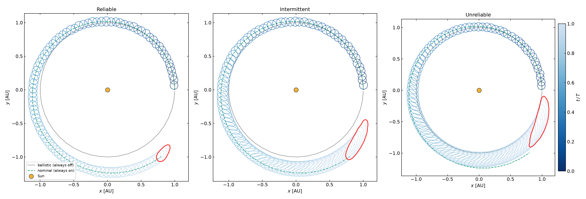
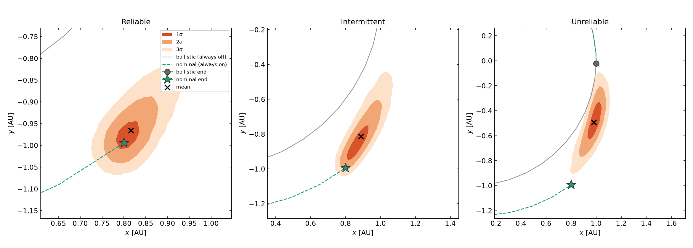
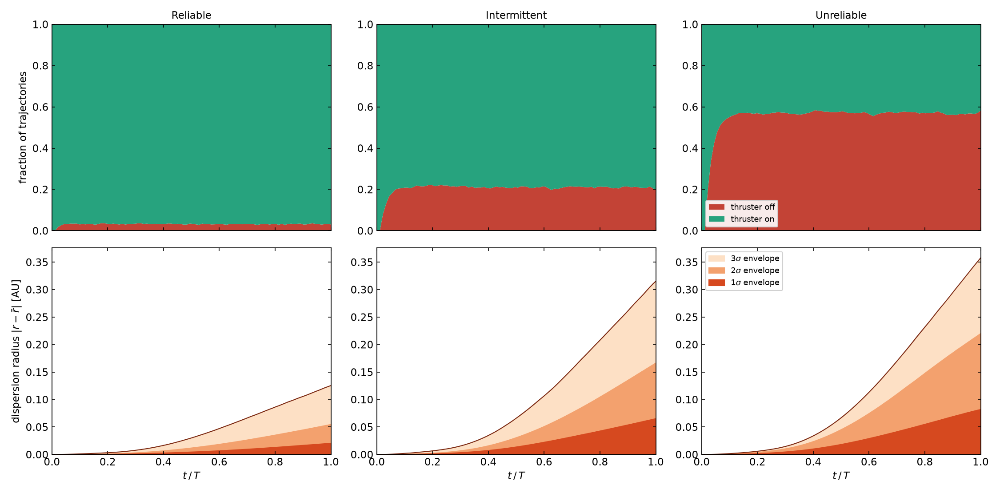

# Missed-thrust on/off duty cycle

Many electric-propulsion missions fly a **bang-bang** thruster: at any instant
it is either fully ON or fully OFF, never throttled in between. When the
thruster trips off unexpectedly, the mission loses thrust until it recovers —
a *missed-thrust* event. This tutorial builds the **dispersion set** of such a
spacecraft over one heliocentric revolution, when the thruster switches on and
off on a **4-day grid** (a 4-day minimum dwell) according to a two-state Markov
chain.

It reuses the machinery of the [missed-thrust dispersion tutorial](missed_thrust.md)
— a DA polynomial surrogate for the execution errors, Monte-Carlo over outage
schedules, and highest-density confidence bands — but replaces the five-level
graded chain with a **binary ON/OFF** thruster model.

Source: [`examples/missed_thrust_onoff/`](https://github.com/andreapasquale94/tax-flow/tree/main/examples/missed_thrust_onoff)
— `common.hpp`, `missed_thrust_onoff.cpp`, `plot.py`.

---

## Problem formulation

### Orbit and nominal plan

The spacecraft moves in the planar heliocentric two-body problem in canonical
units (\(\mu = 1\), \(r_0 = 1\), \(v_0 = 1\), period \(T = 2\pi = 1\) year),
starting on the circular orbit \((x_0,y_0,\dot x_0,\dot y_0) = (1,0,0,1)\). The
nominal plan is **continuous full thrust** at constant magnitude
\(m_\text{nom}\) along the prograde direction (the 1000 kg / 100 mN spacecraft,
\(m_\text{nom} \approx 0.0169\)).

### The 4-day decision grid

The revolution is divided into **91 arcs of 4 days each** (arc duration
\(\Delta = 4\,\text{days}\)). The thruster may only switch state at an arc
boundary, so it **always holds ON or OFF for at least 4 days** — the required
minimum dwell. Each arc \(k\) therefore carries a binary state
\(f_k \in \{0,1\}\) (OFF/ON).

### Uncertainty model

On arc \(k\) the realised acceleration is

$$
\boxed{\;\mathbf{a}_k = f_k\, m_\text{nom}\,(1+\delta_m)\,
        R(\theta_\text{nom}+\delta_\theta)\,\hat{\mathbf v}\;}
$$

with two sources of uncertainty:

- \(f_k \in \{0,1\}\): the **ON/OFF state** — a per-schedule random sequence;
- \(\delta_m \sim \mathcal U[-2\%,+2\%]\) and
  \(\delta_\theta \sim \mathcal U[-5°,+5°]\): the **execution errors**, fixed
  per trajectory and active only while the thruster is ON (\(f_k=1\)).

### Equations of motion

The two execution errors are appended as zero-dynamics components, giving the
six-dimensional state

$$
\mathbf{s} = (\,\delta_m,\;\delta_\theta,\;x,\;y,\;v_x,\;v_y\,),
\qquad \dot\delta_m = \dot\delta_\theta = 0,
$$
$$
\dot x = v_x,\;\; \dot y = v_y,\;\;
\dot v_x = -\frac{x}{r^3} + f_k\,m_\text{nom}(1+\delta_m)\,d_x,\;\;
\dot v_y = -\frac{y}{r^3} + f_k\,m_\text{nom}(1+\delta_m)\,d_y,
$$

with \((d_x,d_y)=R(\theta_\text{nom}+\delta_\theta)\hat{\mathbf v}\) and
\(r=(x^2+y^2)^{1/2}\). On an OFF arc the thrust term vanishes and the motion is
pure Kepler.

### Two-state ON/OFF Markov chain

Whether each arc is ON or OFF follows a sticky two-state chain on
\(\{\text{OFF},\text{ON}\}\), transitioning once per 4-day arc:

$$
P =
\begin{pmatrix}
1-p_\text{recover} & p_\text{recover} \\
p_\text{fail} & 1-p_\text{fail}
\end{pmatrix},
$$

where \(p_\text{fail} = P(\text{ON}\!\to\!\text{OFF})\) (the thruster trips off)
and \(p_\text{recover} = P(\text{OFF}\!\to\!\text{ON})\). Starting ON, the
stationary ON-duty fraction is \(p_\text{recover}/(p_\text{fail}+p_\text{recover})\).
Three scenarios bracket the thruster reliability:

| Scenario | \(p_\text{fail}\) | \(p_\text{recover}\) | ON duty (realised) |
|---|---|---|---|
| Reliable | 0.02 | 0.60 | ≈ 97 % |
| Intermittent | 0.08 | 0.30 | ≈ 79 % |
| Unreliable | 0.20 | 0.15 | ≈ 45 % |

---

## Method: DA surrogate over the execution errors

The two execution errors are the DA expansion variables. The **DA box** is the
small uncertainty rectangle:

```cpp
constexpr int P = 6, M = 2;
tax::ads::Box<double, M> errBox{{0.0, 0.0}, {kSigmaM, kSigmaTheta}};
```

For each Monte-Carlo schedule the DA state is seeded once and propagated **arc
by arc**, with the binary state setting the commanded magnitude:

```cpp
auto x = tax::ads::create<P, M>(errBox, stateIC());
for (int k = 0; k < kNArcs; ++k) {
    double magBase = ThrusterModel::levelFrac(seq[k]) * m_nom;  // m_nom if ON, else 0
    auto sol = tax::ode::propagate(Verner89{},
                   rhs(magBase, theta_nom), x, k*kArc, (k+1)*kArc, cfg);
    x = sol.x.back();          // carry the Taylor map across the arc boundary
    // evaluate x(2), x(3) at 16 random (δm, δθ) → add to the histogram
}
```

Carrying the Taylor-valued state across arc boundaries **composes the per-arc
flow maps** automatically. After each arc the position is a degree-6 polynomial
in \((\delta_m,\delta_\theta)\); evaluating it at 16 random samples per arc is
far cheaper than an integration, so 8000 schedules × 16 draws fill a 130 × 130
histogram at every 4-day snapshot. A direct re-integration of a few schedules
validates the surrogate (max position error ≈ machine zero).

Confidence bands are the **highest-density regions** at the 2-D
Gaussian-equivalent coverage masses (1σ = 39.35 %, 2σ = 86.47 %, 3σ = 98.89 %).

---

## Results

### Dispersion growth over the revolution

Each closed curve is the 3σ dispersion boundary at one 4-day snapshot, coloured
by \(t/T\) (blue early → red final), strung along the orbit on the ballistic
(grey) and nominal (green dashed) references.



The dispersion ellipses trail the spacecraft like beads on a string, widening
as missed-thrust offsets accumulate. The **mean track also lags further behind
the nominal** as reliability drops: more OFF arcs deliver less total impulse, so
the orbit stays closer to the (faster) ballistic circle and the spacecraft
advances further around it — the unreliable beads reach much higher up the
right-hand side than the tightly-clustered reliable ones.

### Final-epoch dispersion — nested 1/2/3σ bands

Zoomed to \(t = T\): the nominal endpoint (green star), ballistic endpoint
(grey circle), and cloud mean (×) anchor the nested bands.



In the reliable case the cloud hugs the nominal endpoint — the spacecraft almost
always thrusts. As reliability drops, the band **grows and its mean migrates
from the nominal endpoint toward the ballistic one**: the unreliable spacecraft
spends more than half its arcs OFF, so on average it behaves much like the
no-thrust orbit, with a broad 3σ spread reflecting *which* arcs happened to miss.

### Duty cycle and dispersion radius vs. time

Two rows per scenario as a function of \(t/T\):

- **Top:** the ON (green) / OFF (red) fraction of trajectories. The unreliable
  panel shows the chain relaxing from its all-ON start to the ≈ 45 % ON
  stationary duty within the first few weeks.
- **Bottom:** the radial dispersion envelope (1/2/3σ). The monotone, accelerating
  growth reflects missed-arc offsets accumulating without cancellation — about
  0.12 AU at \(t=T\) for the reliable thruster, rising to ≈ 0.36 AU for the
  unreliable one.



---

## Run it yourself

```bash
cmake -S . -B build -DTAXFLOW_BUILD_EXAMPLES=ON && cmake --build build -j
cd build/examples

./missed_thrust_onoff reliable       # → missed_thrust_onoff_reliable.json
./missed_thrust_onoff intermittent   # → missed_thrust_onoff_intermittent.json
./missed_thrust_onoff unreliable     # → missed_thrust_onoff_unreliable.json

python3 ../../examples/missed_thrust_onoff/plot.py \
    missed_thrust_onoff_reliable.json \
    missed_thrust_onoff_intermittent.json \
    missed_thrust_onoff_unreliable.json \
    --out missed_thrust_onoff.png
# also writes missed_thrust_onoff_zoom.png and missed_thrust_onoff_time.png
```

### Things to try

- **Change the dwell.** Edit `kArcDays` (and `kNArcs` to keep one revolution):
  a longer minimum dwell means rarer but longer outages — fewer, fatter beads.
- **Tune the thruster.** Raise `pFail` / lower `pRecover` to model a flakier
  unit and watch the mean collapse onto the ballistic endpoint.
- **Force a worst case.** Replace the Markov draw with a deterministic schedule
  (e.g. OFF for one long stretch) to see a single large missed-thrust event in
  isolation.

See the [graded missed-thrust dispersion tutorial](missed_thrust.md) for the
five-level version of this model, and the [low-thrust reachability tutorial](reachability.md)
for the set-valued, control-as-expansion-variable approach.
