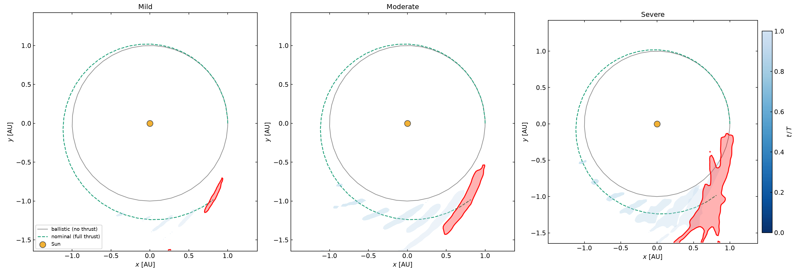
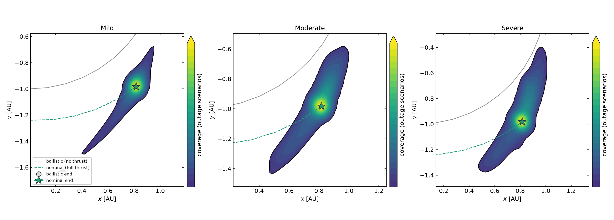

# Missed-thrust reachable set (set-valued)

The [missed-thrust dispersion tutorial](missed_thrust.md) answers a
*probabilistic* question — given a Markov model of outages, where is the
spacecraft *likely* to be? This tutorial answers the complementary
*set-valued* question, with no probabilities at all:

> Over one heliocentric revolution, what region of the orbital plane can the
> spacecraft occupy under **any** admissible thrust outage?

That is a reachable-set problem, and it is solved the same way as the
[low-thrust reachability tutorial](reachability.md): make the uncertainty the
**expansion variables** of a Taylor map and propagate the whole set in one
shot, letting [Automatic Domain Splitting](../ads/index.md) subdivide it where
the map turns nonlinear. The difference is *what* is uncertain: here it is
**when, how long, and how deeply** the thruster drops out.

Source: [`examples/missed_thrust_reachable/`](https://github.com/andreapasquale94/tax-flow/tree/main/examples/missed_thrust_reachable)
— `common.hpp`, `missed_thrust_reachable.cpp`, `plot.py`.

---

## Problem formulation

### Orbit and nominal plan

As in the other low-thrust examples, the spacecraft starts on a circular
heliocentric orbit in canonical units (\(\mu = 1\), \(r_0 = 1\), \(v_0 = 1\),
period \(T = 2\pi\)) at \((x_0,y_0,\dot x_0,\dot y_0) = (1,0,0,1)\), and the
nominal plan is constant prograde thrust at magnitude \(m_\text{nom}\)
(the 1000 kg / 100 mN spacecraft, \(m_\text{nom} \approx 0.0169\)).

### A single outage as three continuous descriptors

We model **one outage event** per revolution by a smooth dip in the delivered
thrust fraction, parameterized by three numbers:

| Descriptor | Meaning | Range |
|---|---|---|
| \(\tau\) | outage **onset** time | \([0,\,T]\) |
| \(w\) | outage **duration** | \([0,\,w_\text{max}]\) |
| \(d\) | outage **depth** (lost thrust fraction) | \([0,\,d_\text{max}]\) |

The delivered fraction is a **smooth top-hat notch** built from two hyperbolic
tangents, so that it is analytic in \((\tau, w, d)\):

$$
g(t;\tau,w) = \tfrac12\!\left[\tanh\!\frac{t-\tau}{\varepsilon}
                              - \tanh\!\frac{t-(\tau+w)}{\varepsilon}\right] \in [0,1],
\qquad
f(t;\tau,w,d) = 1 - d\,g(t;\tau,w) \in [1-d,\,1].
$$

Here \(\varepsilon\) (one 10° arc) is a fixed edge-ramp time — a realistic
thruster spin-down/up rather than an instantaneous switch, and the feature that
keeps the dynamics differentiable in \((\tau, w)\). The realised acceleration is

$$
\boxed{\;\mathbf{a}(t) = f(t;\tau,w,d)\; m_\text{nom}\; R(\theta_\text{nom})\,\hat{\mathbf v}\;}
$$

> **Why drop the execution errors?** The dispersion example also carried the
> \(\pm2\%\) magnitude and \(\pm5°\) pointing execution errors. The reachable
> set is *outage-dominated* — those small errors only thicken its boundary
> marginally — so we omit them here to spend the ADS split budget on the
> strongly nonlinear onset sweep. They could be re-added as two more axes
> (\(M = 5\)) at higher cost.

### Equations of motion

The three descriptors are appended as zero-dynamics state components, giving a
**seven-dimensional** state whose first three components are the DA expansion
axes:

$$
\mathbf{s} = (\,\tau,\;w,\;d,\;x,\;y,\;v_x,\;v_y\,),
\qquad \dot\tau = \dot w = \dot d = 0,
$$
$$
\dot x = v_x,\quad \dot y = v_y,\quad
\dot v_x = -\frac{x}{r^3} + f(t)\,m_\text{nom}\,d_x,\quad
\dot v_y = -\frac{y}{r^3} + f(t)\,m_\text{nom}\,d_y,
$$

with \((d_x,d_y) = R(\theta_\text{nom})\hat{\mathbf v}\) and \(r=(x^2+y^2)^{1/2}\).
The same generic lambda serves the scalar reference path and the DA-valued ADS
state (`tanh`, like `sin`/`cos`/`sqrt`, is overloaded for `TaylorExpansion`).

### The outage box

The reachable set is the image of the **outage box** \(\mathcal B\):

$$
\mathcal B = [0,T] \times [0,w_\text{max}] \times [0,d_\text{max}].
$$

Three scenarios bound the outage budget:

| Scenario | \(w_\text{max}\) | \(d_\text{max}\) |
|---|---|---|
| Mild | \(T/4\) | 0.5 |
| Moderate | \(T/2\) | 1.0 |
| Severe | \(3T/4\) | 1.0 |

---

## Method: one ADS propagation, sampled

### Why ADS is needed

The **onset** \(\tau\) is the hard part. As \(\tau\) sweeps the revolution, the
notch slides across the snapshot time, so the flow map's dependence on \(\tau\)
is strongly nonlinear — a single Taylor polynomial cannot cover the whole box.
This is exactly what ADS is for: it bisects the box (overwhelmingly along
\(\tau\)) until each leaf's flow map meets the truncation tolerance.

```cpp
constexpr int P = 5, M = 3, D = 7;
const tax::ads::TruncationCriterion criterion{ /*tol=*/5e-4, /*maxDepth=*/10 };

auto tree = tax::ads::propagate<P>(
    Verner89{}, criterion, rhs(m_nom, theta_nom), outageBox(scenario),
    stateIC(scenario), 0.0, t, cfg, adsThreads());
```

Each leaf owns a degree-5 flow polynomial \((x,y) = \Phi_\ell(\tau,w,d)\) valid
on its sub-box. A snapshot at \(t = T\) of the moderate scenario splits into a
few hundred leaves, in a few seconds.

### Reading off the reachable set

The reachable set is the **union of the leaf images**. We sample each leaf's
polynomial over its sub-box (volume-weighted so the global sampling density is
uniform) and bin the resulting \((x,y)\) into a shared coverage grid:

```cpp
for (each leaf) {
    int ns = volume_weighted_count(leaf);
    for (ns samples) {
        std::array<double,3> xi = uniform_in([-1,1]^3);
        double px = leaf.payload(3).eval(xi);   // x = state comp 3
        double py = leaf.payload(4).eval(xi);   // y = state comp 4
        grid.add(px, py);                        // out-of-range points dropped
    }
}
```

The **support** of that grid (cells reached at all) is the reachable-set
envelope; the **count** in each cell is a *robustness heat* — how much of the
outage-parameter volume maps into that region.

---

## Results

### Reachable-set growth over the revolution

Each filled region is the reachable set at one 20° snapshot, coloured by
\(t/T\) (final in red), on the ballistic (grey) and nominal (green dashed)
orbits.



Because a single outage window covers at most a fraction of the revolution, the
spacecraft can never miss *all* of its thrust — so the reachable set is a
**crescent that trails the nominal position** as it moves along the orbit,
rather than a cloud filling the disk. For the first third of the revolution the
spread is negligible (an early outage has barely begun to act); it then grows
into the trailing crescent visible in the lower half. The three panels show the
budget dependence directly: the mild scenario barely departs from the nominal
track, while the severe scenario opens a broad reachable region spanning a wide
arc of along-track positions.

### Final reachable set and robustness heat

Zoomed to \(t = T\), the colour grades the coverage from the dense peak at the
nominal endpoint (green star) down through the sparse displaced tail; the black
curve is the reachable-set boundary.



The coverage is sharply **peaked at the nominal endpoint**: most outage
parameterizations — late onset, short duration, or shallow depth — barely move
the spacecraft, so a large share of the box maps near nominal. The boundary,
by contrast, is set by the rare worst cases (early, long, deep outages) that
displace the spacecraft furthest along-track. The reachable band lengthens from
mild to severe, and in the severe case stretches from near the ballistic
endpoint all the way around to the nominal one.

This split — a tight high-confidence core with a long thin worst-case tail — is
the same qualitative picture the probabilistic [dispersion tutorial](missed_thrust.md)
finds from Markov sampling, recovered here as a deterministic, sampling-free
guarantee on the *support*.

---

## Run it yourself

```bash
cmake -S . -B build -DTAXFLOW_BUILD_EXAMPLES=ON && cmake --build build -j
cd build/examples

./missed_thrust_reachable mild       # → missed_thrust_reachable_mild.json
./missed_thrust_reachable moderate   # → missed_thrust_reachable_moderate.json
./missed_thrust_reachable severe     # → missed_thrust_reachable_severe.json

python3 ../../examples/missed_thrust_reachable/plot.py \
    missed_thrust_reachable_mild.json \
    missed_thrust_reachable_moderate.json \
    missed_thrust_reachable_severe.json \
    --out missed_thrust_reachable.png
# also writes missed_thrust_reachable_final.png
```

Each scenario is a single ADS propagation per snapshot (a few seconds on a
multicore machine).

### Things to try

- **Widen the outage budget.** Raise `wMaxFrac` toward 1 and watch the
  reachable crescent close into a full annulus as the spacecraft can miss
  nearly the whole revolution.
- **Sharpen the edge.** Shrink `kEdge` toward an instantaneous switch; the
  onset becomes more nonlinear and ADS responds with more, smaller leaves
  (check the per-snapshot leaf counts in the banner).
- **Add the execution errors back.** Re-introduce \((\delta_m,\delta_\theta)\)
  as two more axes (\(M = 5\)) to thicken the boundary; the split budget then
  has to cover five axes, so expect a tighter tolerance / higher `maxDepth`.
- **Two outages.** Add a second \((\tau_2,w_2,d_2)\) triplet for a chain of
  outages and compare the reachable set with the Markov dispersion cloud.

See the [low-thrust reachability tutorial](reachability.md) for the
constant-control version of this map-the-set trick, and the
[dispersion tutorial](missed_thrust.md) for the probabilistic counterpart.
