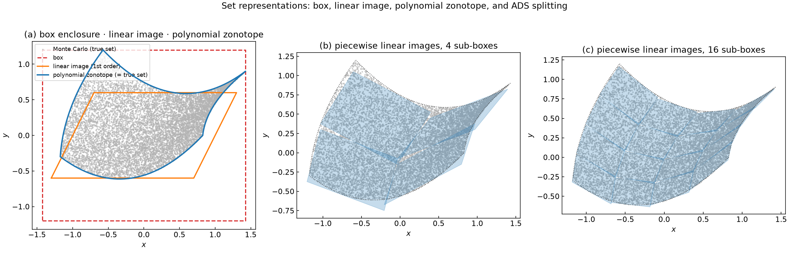
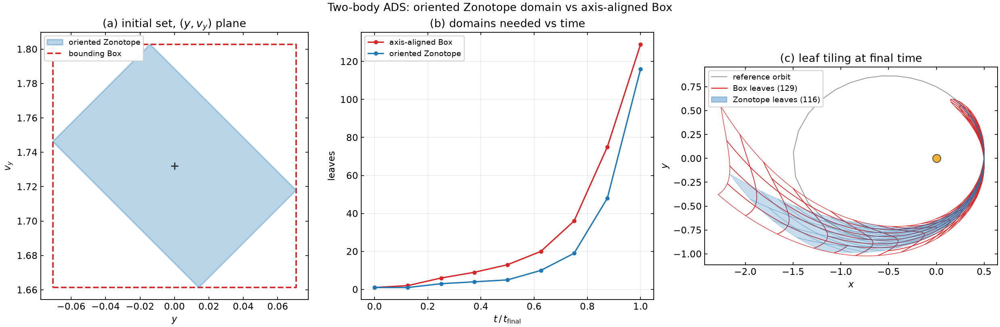
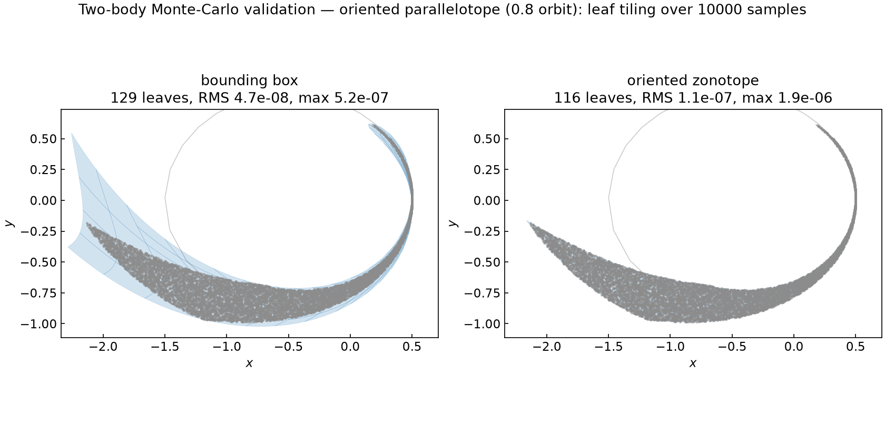
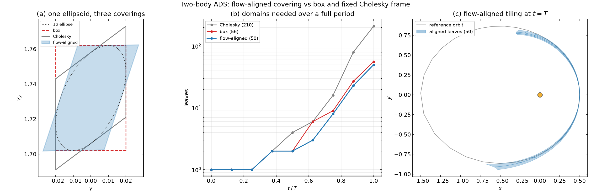
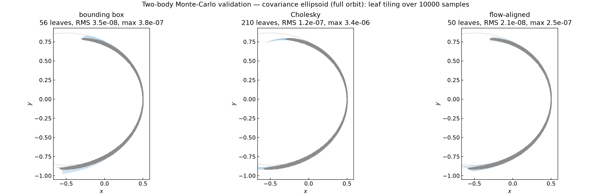
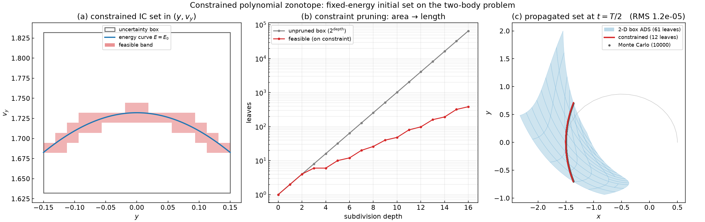

# Oriented domains & polynomial zonotopes

The [two-body tutorial](two_body.md) propagated a **box** of initial conditions
and split it with Automatic Domain Splitting (ADS). This tutorial asks a
different question: *what shape should the domain be?* A box is the simplest
choice, but it is rarely the best fit for the uncertainty you actually have —
a correlated covariance, a thin sliver, a rotated set. Choosing a better domain
shape lets ADS describe the same set with **far fewer leaves**.

We build up the set representations from first principles, show the differences
on a simple domain, then validate everything on the two-body problem against
**10000 Monte-Carlo samples**.

Source: [`examples/zonotope/`](https://github.com/andreapasquale94/tax/tree/main/examples/zonotope)
(`representations.cpp`, `two_body_mc.cpp`),
[`examples/two_body/zonotope.cpp`](https://github.com/andreapasquale94/tax/tree/main/examples/two_body/zonotope.cpp),
[`examples/two_body/zonotope_adaptive.cpp`](https://github.com/andreapasquale94/tax/tree/main/examples/two_body/zonotope_adaptive.cpp),
and the [`tax::ads::Zonotope`](../ads/zonotope.md) module.

---

## A hierarchy of set representations

All of these describe a set as the image of a unit box of **factors**
\(\boldsymbol{\xi} \in [-1, 1]^p\) under some map.

**Interval / box.** An axis-aligned hyperrectangle,

$$
\mathcal{B} = \{\, \mathbf{c} + \mathrm{diag}(\mathbf{h})\,\boldsymbol{\xi} \;:\; \boldsymbol{\xi} \in [-1,1]^p \,\}.
$$

Cheap, but it can only stretch along the coordinate axes.

**Zonotope.** Replace the diagonal of half-widths by a full **generator
matrix** \(G\):

$$
\mathcal{Z} = \{\, \mathbf{c} + G\,\boldsymbol{\xi} \;:\; \boldsymbol{\xi} \in [-1,1]^p \,\}.
$$

This is a *parallelotope* (when \(G\) is square) — an affine image of the cube,
free to orient and shear. A box is the special case \(G = \mathrm{diag}(\mathbf{h})\).

**Polynomial zonotope.** Let the factors enter through a **polynomial** instead
of a linear map (Althoff 2013; Kochdumper & Althoff 2020):

$$
\mathcal{PZ} = \Big\{\, \mathbf{c} + \sum_{i} \Big(\textstyle\prod_{k} \xi_k^{E_{ki}}\Big)\, \mathbf{g}_i \;:\; \boldsymbol{\xi} \in [-1,1]^p \,\Big\}.
$$

This is exactly a **Taylor / DA flow map** evaluated over a box: the
coefficients \(\mathbf{g}_i\) are the expansion coefficients and \(E\) the
exponent matrix. A polynomial zonotope can bend and fold, so it captures the
curvature a linear zonotope cannot.

**Constrained (polynomial) zonotope.** Add equality constraints on the factors,
\(A\boldsymbol{\xi} = \mathbf{b}\) (Scott et al. 2016; Kochdumper & Althoff
2020). Constraints let a zonotope represent *any* convex polytope and let you
split a domain by *adding a half-space* instead of bisecting.

### What `tax-flow` actually stores

Each ADS **leaf** holds a DA flow map over its factor box — i.e. a
**polynomial zonotope**. The [`tax::ads::Zonotope`](../ads/zonotope.md) domain
gives that leaf an **oriented (parallelotope) factor box** instead of an
axis-aligned one. ADS subdivision turns the whole tree into a **piecewise
polynomial zonotope**: a union of leaves that tile the propagated set.

Two further ingredients are prototyped:

* **Orientation** — [`tax::ads::Zonotope`](../ads/zonotope.md) makes the factor
  box oriented; choosing that orientation from the flow (below) needs the fewest
  leaves.
* **Polynomial equality constraints** \(g_j(\boldsymbol{\xi}) = 0\) —
  [`tax::ads::cpz`](#constrained-polynomial-zonotopes) carries one or more
  constraint polynomials alongside the value map, giving the genuine
  **constrained polynomial zonotope** and the *split-by-constraint* pruning that
  collapses a box onto a lower-dimensional set.

### On a simple domain

`zonotope_representations` pushes one square of initial conditions through an
explicit degree-2 map
\(\varphi(p,q) = (\,p + \tfrac12 q + 0.35\,q^2,\; q + 0.45\,p^2 - 0.25\,pq\,)\)
and draws each representation of the image, with a 10000-point Monte-Carlo
cloud as ground truth.



* **(a)** The polynomial zonotope (blue) coincides with the true set — the map
  is degree 2 and the expansion order is \(P \ge 2\), so it is *exact*; the MC
  cloud fills it. The axis-aligned **box** (red) is a valid but loose enclosure.
  The **linear image** (orange) is the first-order term only: it misses the
  curvature, so it is *not* an enclosure on its own (a pure zonotope method
  would inflate it with a remainder).
* **(b, c)** Splitting the factor box into 4 then 16 sub-boxes and taking each
  piece's linear image — the pieces converge onto the curved set. This is the
  essence of ADS: many low-order pieces describe a curved set that one piece
  cannot.

---

## Oriented domains on the two-body problem

Now the map is a full Kepler orbit. The initial uncertainty varies the
\(y\) position and \(v_y\) velocity of the \(e=0.5\) orbit. The classic ADS box
must be axis-aligned; an oriented `Zonotope` can wrap a **correlated** set
directly. `two_body/zonotope.cpp` propagates a 45°-rotated parallelotope and
the axis-aligned box that bounds it:



Over most of the orbit the oriented set needs fewer leaves (e.g. **48 vs 75**
mid-arc): its rotated factors align with the flow, while the larger bounding box
carries more truncation mass and over-splits.

### Monte-Carlo validation

Does the piecewise polynomial zonotope actually reproduce the true set?
`zonotope_two_body_mc` draws 10000 samples of the *same* oriented set,
propagates each with a high-accuracy scalar integrator to \(t = 0.8\,T\), and
overlays the cloud on the leaf tiling.



Both coverings **envelope the 10000-sample cloud**, and both reproduce it to
RMS \(\sim 10^{-7}\) — but the box (left) wastes leaves on the empty fan its
bounding rectangle includes, while the oriented zonotope (right) hugs the
crescent. Same accuracy, fewer leaves.

| Covering | Leaves | RMS error | Max error |
|----------|-------:|----------:|----------:|
| Bounding box | 129 | 4.7 × 10⁻⁸ | 5.2 × 10⁻⁷ |
| Oriented zonotope | **116** | 1.1 × 10⁻⁷ | 1.9 × 10⁻⁶ |

---

## Choosing the orientation from the flow

A *fixed* orientation is a gamble. Over a **full** period the same 45° frame
actually loses (it ends up mis-aligned with the periapsis-return shear). The fix
is to choose the frame from the dynamics — only possible when the uncertainty is
an **ellipsoid** (a covariance), because then the covering parallelotope is free
to orient. The recipe (`two_body/zonotope_adaptive.cpp`,
[`tax::ads::reorient`](../ads/zonotope.md#adaptive-orientation-aligning-the-frame-to-the-flow)):

1. **Probe** — propagate the un-split identity once to read the linear flow map
   \(\Phi = \partial \mathbf{x}/\partial\boldsymbol{\xi}\) over the horizon.
2. **Align** — with covariance \(\Sigma = L L^\top\), take the right-singular
   vectors \(V\) of \(\Phi L\). The covering generators \(G = L V\) make the
   propagated set \(\Phi L V = U\Sigma\) have **orthogonal** generators — no thin
   diagonal sliver for axis-aligned splits to over-cut.



Three coverings of the *same* ellipsoid over a full period: the **flow-aligned**
frame needs the fewest leaves at every snapshot — even though it covers a
*larger* initial area than the box. The win is orientation, not size: a badly
oriented frame (the fixed Cholesky one) is 4× worse. Re-expressing the probe map
in the aligned frame with `reorientState` confirms the deformation is
diagonalised (the STM off-diagonal drops from ≈ 1.2 to ≈ 0).

### Monte-Carlo validation

Sampling 10000 points from the 1σ ellipsoid and propagating each to the full
period:



All three coverings envelope the cloud and reproduce it to RMS \(\sim 10^{-7}\)
— the flow-aligned frame does it with the **fewest leaves and the lowest
error**:

| Covering | Leaves | RMS error | Max error |
|----------|-------:|----------:|----------:|
| Bounding box | 56 | 3.5 × 10⁻⁸ | 3.8 × 10⁻⁷ |
| Cholesky (covariance only) | 210 | 1.2 × 10⁻⁷ | 3.4 × 10⁻⁶ |
| **Flow-aligned** | **50** | **2.1 × 10⁻⁸** | **2.5 × 10⁻⁷** |

The Monte-Carlo errors sit at the split tolerance (\(10^{-6}\)), confirming the
leaf polynomial zonotopes do not merely *bound* the propagated set — they
*reproduce* it pointwise to the requested accuracy.

---

## Constrained polynomial zonotopes

Everything above describes an *unconstrained* set — the factors range over the
whole box. A **constrained polynomial zonotope** ([`tax::ads::cpz`](https://github.com/andreapasquale94/tax/tree/main/include/tax/ads/cpz.hpp))
adds polynomial equality constraints on those factors:

$$
\big\{\, \mathbf{x}(\boldsymbol{\xi}) \;:\; \boldsymbol{\xi} \in [-1,1]^M,\; g_j(\boldsymbol{\xi}) = 0 \big\}.
$$

The constraints carve a **lower-dimensional sub-manifold** out of the box. A
natural astrodynamics case: the initial state is uncertain in \((y, v_y)\), but
the spacecraft is known to be on an orbit of fixed **energy** (fixed
semi-major axis). The valid ICs are then the curve
\(\{(y, v_y) \in \text{box} : E(y, v_y) = E_0\}\), with
\(E = \tfrac12 v^2 - 1/r\). Expanding the energy as a DA gives a *polynomial*
constraint \(g(\boldsymbol{\xi}) = E(\boldsymbol{\xi}) - E_0\) — exactly a CPZ
(`examples/two_body/cpz.cpp`).

Because the constraint is a polynomial in the same factors, it **splits like the
value map** (the same `substituteAxis` re-expansion), and it gives a cheap
emptiness test: over \(\boldsymbol{\xi} \in [-1,1]^M\) the constraint ranges
within \([g_0 - r,\, g_0 + r]\) with \(r = \sum_{\alpha\neq 0} |g_\alpha|\). If
\(0\) is outside that interval the sub-box **cannot** satisfy \(g=0\) and the
leaf is pruned. Subdivide, prune the infeasible children, and only the band
straddling the constraint survives.



* **(a)** The fixed-energy curve through the \((y, v_y)\) box, and the feasible
  band of sub-boxes that survives pruning — a thin sleeve around the curve, not
  the whole box.
* **(b)** **Dimensional collapse.** As the box is subdivided, the unpruned cell
  count grows like the *area* (\(2^{\text{depth}}\)); the feasible count grows
  only like the *length* (\(\approx 2^{\text{depth}/2}\)). At depth 16 that is
  **384 feasible** cells out of 65536.
* **(c)** Propagated to \(t = T/2\): the unconstrained box needs a **2-D ADS
  tiling of 61 leaves**, but the constrained set is the **1-D curve carried by
  just 12 leaves**. The red curve runs through the blue blob along where the
  fixed-energy ICs actually land.

Validated against **10000 Monte-Carlo samples drawn on the true energy curve**
(propagated independently), the constrained leaves reproduce the cloud to
RMS \(\approx 1.2\times10^{-5}\) (max \(6.3\times10^{-5}\)) — larger than the
earlier cases because this box is ~5× wider, still at the \(10^{-6}\) split
tolerance.

| Representation | Leaves | Dimension |
|----------------|-------:|:---------:|
| Unconstrained box (2-D ADS) | 61 | 2 |
| **Fixed-energy CPZ** | **12** | 1 |

This is the **split-by-constraint** lever: the constraint does not just describe
the set, it *prunes the work*, collapsing a 2-D box onto its 1-D constrained
slice.

---

## Reproduce it

```bash
cmake -S . -B build -DCMAKE_BUILD_TYPE=Release -DTAXFLOW_BUILD_EXAMPLES=ON
cmake --build build -j

# simple-domain representations
./build/examples/zonotope_representations
python3 examples/plot/plot_representations.py

# oriented domains on two-body + leaf-count curves
./build/examples/two_body_zonotope
python3 examples/plot/plot_two_body_zonotope.py

# adaptive flow-aligned orientation
./build/examples/two_body_zonotope_adaptive
python3 examples/plot/plot_two_body_zonotope_adaptive.py

# 10000-sample Monte-Carlo validation (both scenarios)
./build/examples/zonotope_two_body_mc
python3 examples/plot/plot_two_body_mc.py

# constrained polynomial zonotope (fixed-energy set)
./build/examples/two_body_cpz
python3 examples/plot/plot_two_body_cpz.py
```

---

## Limitations

This is a prototype of the oriented / polynomial-zonotope path; the honest
boundaries:

* **Parallelotope generators are square** (no redundant generators), so
  arbitrary-polytope coverage is still future work.
* **Constraints are prototyped but not wired into the driver.** `tax::ads::cpz`
  carries and splits polynomial constraints and prunes infeasible leaves, but
  the demonstration prunes a separate subdivision / filters an ordinary ADS run
  rather than pruning *inside* `AdsDriver` in flight. Constraint feasibility uses
  the first-order interval bound (\(L_1\) of the coefficients), which is sound
  but not the tightest possible test.
* **Orientation is chosen once, up front.** The flow-aligned frame comes from a
  single probe STM over the whole horizon. `reorientState` is the building block
  for *time-adaptive* re-orientation, but re-orienting mid-flight needs an
  over-approximation (a rotation maps the factor cube to a non-cube) and is not
  wired into the driver.
* **Ellipsoidal ICs for the adaptive case.** Re-orientation is exact only when
  the covering parallelotope is free to orient — i.e. the uncertainty is an
  ellipsoid. A fixed physical parallelotope cannot be re-oriented without
  changing the represented set.
* **`refine.hpp` is not generalised** to the `Zonotope` domain; the classic
  `AdsDriver` / `propagate` path is.

See the [`Zonotope` module reference](../ads/zonotope.md) for the API and the
geometric details.
