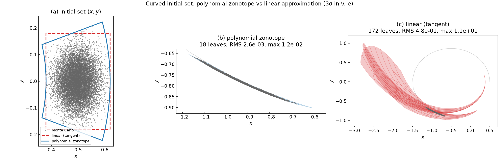

# Oriented domains & polynomial zonotopes

The [two-body tutorial](two_body.md) propagated a **box** of initial conditions
and split it with Automatic Domain Splitting (ADS). This tutorial asks a
different question: *what shape should the domain be?* A box is the simplest
choice, but it is rarely the best fit for the uncertainty you actually have —
a correlated covariance, a thin sliver, a rotated set. Choosing a better domain
shape lets ADS describe the same set with **far fewer leaves**.

We build up the set representations from first principles, show the differences
on a simple domain, then validate everything on the two-body problem against
**10000 Monte-Carlo samples**.

Source: [`examples/zonotope/`](https://github.com/andreapasquale94/tax/tree/main/examples/zonotope)
(`representations.cpp`, `two_body_mc.cpp`) and
[`examples/two_body/`](https://github.com/andreapasquale94/tax/tree/main/examples/two_body)
(`poly_zonotope.cpp`, `zonotope.cpp`, `zonotope_adaptive.cpp`), with the
[`tax::ads::PolyZonotope`](../ads/zonotope.md) and
[`tax::ads::Zonotope`](../ads/zonotope.md) modules.

---

## A hierarchy of set representations

All of these describe a set as the image of a unit box of **factors**
\(\boldsymbol{\xi} \in [-1, 1]^p\) under some map.

**Interval / box.** An axis-aligned hyperrectangle,

$$
\mathcal{B} = \{\, \mathbf{c} + \mathrm{diag}(\mathbf{h})\,\boldsymbol{\xi} \;:\; \boldsymbol{\xi} \in [-1,1]^p \,\}.
$$

Cheap, but it can only stretch along the coordinate axes.

**Zonotope.** Replace the diagonal of half-widths by a full **generator
matrix** \(G\):

$$
\mathcal{Z} = \{\, \mathbf{c} + G\,\boldsymbol{\xi} \;:\; \boldsymbol{\xi} \in [-1,1]^p \,\}.
$$

This is a *parallelotope* (when \(G\) is square) — an affine image of the cube,
free to orient and shear. A box is the special case \(G = \mathrm{diag}(\mathbf{h})\).

**Polynomial zonotope.** Let the factors enter through a **polynomial** instead
of a linear map (Althoff 2013; Kochdumper & Althoff 2020):

$$
\mathcal{PZ} = \Big\{\, \mathbf{c} + \sum_{i} \Big(\textstyle\prod_{k} \xi_k^{E_{ki}}\Big)\, \mathbf{g}_i \;:\; \boldsymbol{\xi} \in [-1,1]^p \,\Big\}.
$$

This is exactly a **Taylor / DA flow map** evaluated over a box: the
coefficients \(\mathbf{g}_i\) are the expansion coefficients and \(E\) the
exponent matrix. A polynomial zonotope can bend and fold, so it captures the
curvature a linear zonotope cannot.

**Constrained (polynomial) zonotope.** Add equality constraints on the factors,
\(A\boldsymbol{\xi} = \mathbf{b}\) (Scott et al. 2016; Kochdumper & Althoff
2020). Constraints let a zonotope represent *any* convex polytope and carve out
lower-dimensional sub-manifolds — useful for level sets and event preimages, but
not implemented in this prototype.

### What `tax-flow` actually stores

Each ADS **leaf** holds a DA flow map over its factor box — i.e. a
**polynomial zonotope**. The [`tax::ads::Zonotope`](../ads/zonotope.md) domain
gives that leaf an **oriented (parallelotope) factor box** instead of an
axis-aligned one. ADS subdivision turns the whole tree into a **piecewise
polynomial zonotope**: a union of leaves that tile the propagated set.

Two things lift it past the plain box:

* **A curved initial set** — [`tax::ads::PolyZonotope`](#curved-initial-sets-the-polynomial-zonotope-domain)
  makes the *initial* map itself a polynomial (degree ≥ 2), so a bent uncertainty
  is described exactly at \(t_0\), not just after the flow bends it.
* **Orientation** — [`tax::ads::Zonotope`](../ads/zonotope.md) makes the factor
  box oriented; choosing that orientation from the flow needs the fewest leaves.

### On a simple domain

`zonotope_representations` pushes one square of initial conditions through an
explicit degree-2 map
\(\varphi(p,q) = (\,p + \tfrac12 q + 0.35\,q^2,\; q + 0.45\,p^2 - 0.25\,pq\,)\)
and draws each representation of the image, with a 10000-point Monte-Carlo
cloud as ground truth.


* **(a)** The polynomial zonotope (blue) coincides with the true set — the map
  is degree 2 and the expansion order is \(P \ge 2\), so it is *exact*; the MC
  cloud fills it. The axis-aligned **box** (red) is a valid but loose enclosure.
  The **linear image** (orange) is the first-order term only: it misses the
  curvature, so it is *not* an enclosure on its own (a pure zonotope method
  would inflate it with a remainder).
* **(b, c)** Splitting the factor box into 4 then 16 sub-boxes and taking each
  piece's linear image — the pieces converge onto the curved set. This is the
  essence of ADS: many low-order pieces describe a curved set that one piece
  cannot.

---

## Curved initial sets: the polynomial-zonotope domain

The most direct use of a polynomial zonotope is to describe an initial set that
is **already bent** — before any propagation. This happens whenever the
uncertainty is Gaussian in one coordinate system but expressed in another. A
classic astrodynamics case: the orbit is known up to a Gaussian in **true
anomaly** \(\nu\) (where along the orbit) and **eccentricity** \(e\) (its shape).
The element→Cartesian map is nonlinear, so in Cartesian state that uncertainty is
a **banana**, not an ellipse.

**Why not just a linear set?** The image of a box under an *affine* map
\(\mathbf{c} + G\boldsymbol{\xi}\) is always a **parallelotope** — flat faces,
straight edges, symmetric about \(\mathbf{c}\). That is all a linear
representation (a covariance / STM ellipse) can ever be. Expanding the true map
about the centre, \(\mathbf{x}_0(\boldsymbol{\xi}) = \mathbf{c} + J\boldsymbol{\xi}
+ \tfrac12\boldsymbol{\xi}^\top H\boldsymbol{\xi} + \dots\), the linear set keeps
only the first-order term and sits on the tangent plane; the real set bends off
it by the curvature term. At **3σ** the factor \(\boldsymbol{\xi}\sim O(1)\), so
that curvature is the *same order* as the spread — not a small correction.

[`tax::ads::PolyZonotope`](../ads/zonotope.md) keeps the polynomial terms,
\(\mathbf{x}_0(\boldsymbol{\xi}) = \mathbf{c} + \sum_i (\prod_k \xi_k^{E_{ki}})\,\mathbf{g}_i\),
so it bends to follow the manifold. Because the ADS pipeline is generic over the
domain, that curved set propagates and subdivides like any other — the only new
ingredient is that the *t₀* geometry is itself a DA map, built with ordinary TE
arithmetic (`examples/two_body/poly_zonotope.cpp`).

We take a sizeable **3σ** Gaussian in \((\nu, e)\) — \(\pm21^\circ\) in anomaly,
\(e \in [0.38, 0.62]\) — and compare the curved polynomial zonotope against its
**tangent (linear) approximation** — the ellipse a covariance / STM gives —
propagating both to \(t = 0.75\,T\) and validating against 10000 Monte-Carlo
samples drawn from the element-space Gaussian.



* **(a)** At \(t_0\) the bend is mild — the polynomial zonotope (blue) and the
  tangent ellipse (red) both roughly bound the cloud.
* **(b)** Propagated, the curved set tracks the Monte-Carlo cloud tightly,
  tiling the bent arc with **18 leaves** (RMS \(2.6\times10^{-3}\)).
* **(c)** The linear initial set, propagated, **smears ~10× past the cloud** —
  its wrong \(t_0\) shape is amplified by the flow into a gross
  over-approximation (RMS \(0.48\), **max \(11\)**), and it costs **172 leaves**
  chasing the distortion.

| Initial set | Leaves | RMS error | Max error |
|-------------|-------:|----------:|----------:|
| **Polynomial zonotope (curved)** | **18** | **2.6 × 10⁻³** | **1.2 × 10⁻²** |
| Linear (tangent ellipse) | 172 | 4.8 × 10⁻¹ | 1.1 × 10¹ |

The curved orbit-manifold set stays compact — 18 leaves wrap the whole bent arc —
while the linear approximation needs ~10× more leaves *and* is wrong. Push the
set wider or longer and the tangent set reaches near-collision states that blow
up entirely; the polynomial zonotope, anchored on valid orbits, does not. At 3σ
the curvature is not a correction — it is the difference between a right answer
and a useless one.

---

## Oriented domains on the two-body problem

Now the map is a full Kepler orbit. The initial uncertainty varies the
\(y\) position and \(v_y\) velocity of the \(e=0.5\) orbit. The classic ADS box
must be axis-aligned; an oriented `Zonotope` can wrap a **correlated** set
directly. `two_body/zonotope.cpp` propagates a 45°-rotated parallelotope and
the axis-aligned box that bounds it:


Over most of the orbit the oriented set needs fewer leaves (e.g. **48 vs 75**
mid-arc): its rotated factors align with the flow, while the larger bounding box
carries more truncation mass and over-splits.

### Monte-Carlo validation

Does the piecewise polynomial zonotope actually reproduce the true set?
`zonotope_two_body_mc` draws 10000 samples of the *same* oriented set,
propagates each with a high-accuracy scalar integrator to \(t = 0.8\,T\), and
overlays the cloud on the leaf tiling.


Both coverings **envelope the 10000-sample cloud**, and both reproduce it to
RMS \(\sim 10^{-7}\) — but the box (left) wastes leaves on the empty fan its
bounding rectangle includes, while the oriented zonotope (right) hugs the
crescent. Same accuracy, fewer leaves.

| Covering | Leaves | RMS error | Max error |
|----------|-------:|----------:|----------:|
| Bounding box | 129 | 4.7 × 10⁻⁸ | 5.2 × 10⁻⁷ |
| Oriented zonotope | **116** | 1.1 × 10⁻⁷ | 1.9 × 10⁻⁶ |

---

## Choosing the orientation from the flow

A *fixed* orientation is a gamble. Over a **full** period the same 45° frame
actually loses (it ends up mis-aligned with the periapsis-return shear). The fix
is to choose the frame from the dynamics — only possible when the uncertainty is
an **ellipsoid** (a covariance), because then the covering parallelotope is free
to orient. The recipe (`two_body/zonotope_adaptive.cpp`,
[`tax::ads::reorient`](../ads/zonotope.md#adaptive-orientation-aligning-the-frame-to-the-flow)):

1. **Probe** — propagate the un-split identity once to read the linear flow map
   \(\Phi = \partial \mathbf{x}/\partial\boldsymbol{\xi}\) over the horizon.
2. **Align** — with covariance \(\Sigma = L L^\top\), take the right-singular
   vectors \(V\) of \(\Phi L\). The covering generators \(G = L V\) make the
   propagated set \(\Phi L V = U\Sigma\) have **orthogonal** generators — no thin
   diagonal sliver for axis-aligned splits to over-cut.


Three coverings of the *same* ellipsoid over a full period: the **flow-aligned**
frame needs the fewest leaves at every snapshot — even though it covers a
*larger* initial area than the box. The win is orientation, not size: a badly
oriented frame (the fixed Cholesky one) is 4× worse. Re-expressing the probe map
in the aligned frame with `reorientState` confirms the deformation is
diagonalised (the STM off-diagonal drops from ≈ 1.2 to ≈ 0).

### Monte-Carlo validation

Sampling 10000 points from the 1σ ellipsoid and propagating each to the full
period:


All three coverings envelope the cloud and reproduce it to RMS \(\sim 10^{-7}\)
— the flow-aligned frame does it with the **fewest leaves and the lowest
error**:

| Covering | Leaves | RMS error | Max error |
|----------|-------:|----------:|----------:|
| Bounding box | 56 | 3.5 × 10⁻⁸ | 3.8 × 10⁻⁷ |
| Cholesky (covariance only) | 210 | 1.2 × 10⁻⁷ | 3.4 × 10⁻⁶ |
| **Flow-aligned** | **50** | **2.1 × 10⁻⁸** | **2.5 × 10⁻⁷** |

The Monte-Carlo errors sit at the split tolerance (\(10^{-6}\)), confirming the
leaf polynomial zonotopes do not merely *bound* the propagated set — they
*reproduce* it pointwise to the requested accuracy.

---

## Reproduce it

```bash
cmake -S . -B build -DCMAKE_BUILD_TYPE=Release -DTAXFLOW_BUILD_EXAMPLES=ON
cmake --build build -j

# simple-domain representations
./build/examples/zonotope_representations
python3 examples/plot/plot_representations.py

# curved initial set (polynomial zonotope vs linear)
./build/examples/two_body_poly_zonotope
python3 examples/plot/plot_two_body_poly_zonotope.py

# oriented domains on two-body + leaf-count curves
./build/examples/two_body_zonotope
python3 examples/plot/plot_two_body_zonotope.py

# adaptive flow-aligned orientation
./build/examples/two_body_zonotope_adaptive
python3 examples/plot/plot_two_body_zonotope_adaptive.py

# 10000-sample Monte-Carlo validation (both scenarios)
./build/examples/zonotope_two_body_mc
python3 examples/plot/plot_two_body_mc.py
```

---

## Limitations

This is a prototype of the oriented / polynomial-zonotope path; the honest
boundaries:

* **Parallelotope generators are square** (no redundant generators), and there
  are no factor **constraints** \(g_j(\boldsymbol{\xi})=0\), so arbitrary-polytope
  coverage and constrained sub-manifolds (level sets, event preimages) are future
  work.
* **The curved domain carries its t₀ map per leaf** (in addition to the
  propagated payload), so a `PolyZonotope` leaf uses ~2× the memory of a linear
  one, and point-location (`contains`) uses a first-order inverse.
* **Orientation is chosen once, up front.** The flow-aligned frame comes from a
  single probe STM over the whole horizon. `reorientState` is the building block
  for *time-adaptive* re-orientation, but re-orienting mid-flight needs an
  over-approximation (a rotation maps the factor cube to a non-cube) and is not
  wired into the driver.
* **Ellipsoidal ICs for the adaptive case.** Re-orientation is exact only when
  the covering parallelotope is free to orient — i.e. the uncertainty is an
  ellipsoid. A fixed physical parallelotope cannot be re-oriented without
  changing the represented set.
* **`refine.hpp` is not generalised** to the `Zonotope` domain; the classic
  `AdsDriver` / `propagate` path is.

See the [`Zonotope` module reference](../ads/zonotope.md) for the API and the
geometric details.
