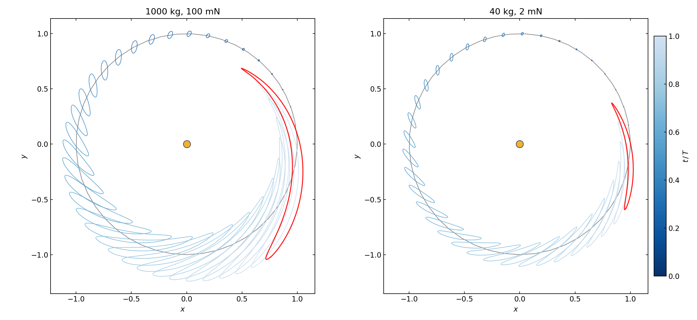

# Low-thrust reachability

This tutorial computes a **reachability set**: the region of space a spacecraft
can reach by steering a continuous low thrust over one orbit. Instead of
sampling thousands of control choices with separate integrations, we treat the
*control* as the expansion variables of a Taylor map and propagate the whole
control set in one shot, letting [Automatic Domain Splitting](../ads/index.md)
(ADS) subdivide it where the map turns nonlinear. The boundary of the reachable
set — its **envelope** — then falls straight out of the flow map.

Source: [`examples/reachability/`](https://github.com/andreapasquale94/tax-flow/tree/main/examples/reachability)
— `common.hpp`, `reachability.cpp`, `plot.py`.

## The problem

A spacecraft on a **circular heliocentric orbit** at the Earth semi-major axis,
in canonical units (\(\mu = 1\), \(r_0 = 1\), circular speed \(v_0 = 1\), period
\(T = 2\pi\)). It thrusts continuously at a **constant** acceleration held fixed
for the whole revolution, with magnitude \(m\) and a direction measured *from the
instantaneous velocity* (\(\theta = 0\) is prograde):

$$
\mathbf{a} = m\,R(\theta)\,\hat{\mathbf v},
\qquad
\hat{\mathbf v} = \frac{(v_x, v_y)}{\lVert \mathbf v \rVert},
\qquad
R(\theta) = \begin{pmatrix}\cos\theta & -\sin\theta\\ \sin\theta & \cos\theta\end{pmatrix}.
$$

The dynamics are the planar two-body problem plus this thrust term:

$$
\dot x = v_x,\quad
\dot y = v_y,\quad
\dot v_x = -\frac{x}{r^3} + m\,d_x,\quad
\dot v_y = -\frac{y}{r^3} + m\,d_y,
$$

with \((d_x, d_y) = R(\theta)\hat{\mathbf v}\) and \(r = \sqrt{x^2 + y^2}\).

The **control set** is the magnitude–direction rectangle

$$
m \in [0,\, a_{\max}], \qquad \theta \in [0,\, 2\pi),
$$

where \(a_{\max}\) is the spacecraft's maximum thrust acceleration — its control
authority. The reachable set at time \(t\) is the image of this rectangle under
the flow.

## Control as expansion variables

The DA/ADS machinery expands the flow in the components of an initial-condition
box. Here we want the expansion variables to be the **control**, not the initial
state. The trick is to carry the two control parameters as extra state
components with *zero dynamics*, so the integrator sees them as constants that
the right-hand side can read:

$$
\mathbf{s} = (\,m,\; \theta,\; x,\; y,\; v_x,\; v_y\,),
\qquad \dot m = 0,\quad \dot\theta = 0 .
$$

The ADS box is then two-dimensional (\(M = 2\)) over \((m, \theta)\), while the
state is six-dimensional (\(D = 6\)). Because only the two control axes carry an
expansion direction, each component is a Taylor polynomial in just
\(\binom{P+2}{2}\) coefficients — cheap, even though the state vector is longer.
The right-hand side is a single generic lambda, valid for both `double` and
Taylor-valued states:

```cpp
inline auto rhs()
{
    return []( const auto& s, const auto& /*t*/ )
    {
        using S        = std::decay_t< decltype( s ) >;
        const auto m   = s( 0 );   // thrust magnitude  (constant control)
        const auto th  = s( 1 );   // thrust angle from velocity (constant control)
        const auto x   = s( 2 );
        const auto y   = s( 3 );
        const auto vx  = s( 4 );
        const auto vy  = s( 5 );

        const auto r2   = x * x + y * y;
        const auto r3   = r2 * sqrt( r2 );
        const auto vmag = sqrt( vx * vx + vy * vy );   // > 0 on a Kepler orbit
        const auto ux = vx / vmag, uy = vy / vmag;
        const auto c  = cos( th ), sn = sin( th );
        const auto dx = c * ux - sn * uy;              // R(theta) * vhat
        const auto dy = sn * ux + c * uy;

        const auto zero = m - m;                       // typed zero (double or TE)
        S out;
        out( 0 ) = zero;                 // d(m)/dt     = 0
        out( 1 ) = zero;                 // d(theta)/dt = 0
        out( 2 ) = vx;
        out( 3 ) = vy;
        out( 4 ) = -x / r3 + m * dx;
        out( 5 ) = -y / r3 + m * dy;
        return out;
    };
}
```

## Choosing \(a_{\max}\)

\(a_{\max}\) is set by the thruster, not picked by hand. With thrust \(F\) and
spacecraft mass \(M_\mathrm{sc}\), the physical acceleration \(F/M_\mathrm{sc}\)
is normalized by the acceleration unit at 1 AU,
\(\mu_\odot / \mathrm{AU}^2 = 5.9301\times10^{-3}\ \mathrm{m/s^2}\) (which equals
the local gravity on a circular orbit):

$$
a_{\max} = \frac{F / M_\mathrm{sc}}{\mu_\odot / \mathrm{AU}^2}.
$$

The example ships two presets, selected on the command line:

| Preset (`argv[1]`) | Mass | Thrust | \(a_{\max}\) |
|---|---|---|---|
| `spacecraft` | 1000 kg | 100 mN | \(\approx 0.0169\) |
| `cubesat`    | 40 kg   | 2 mN   | \(\approx 0.0084\) |

```cpp
inline constexpr Preset kSpacecraft{ "1000 kg, 100 mN", 0.100, 1000.0, "reachability.json" };
inline constexpr Preset kCubeSat{ "40 kg, 2 mN", 0.002, 40.0, "reachability_cubesat.json" };

[[nodiscard]] inline constexpr double aMax( const Preset& p )
{
    return ( p.thrustN / p.massKg ) / kAccelUnit;   // kAccelUnit = 5.9301e-3 m/s^2
}
```

## Propagation and splitting

The control box is centered so that \(m\) spans \([0, a_{\max}]\) and \(\theta\)
spans the full circle (half-width \(\pi\)):

$$
\text{center} = \big(\tfrac{a_{\max}}{2},\, \pi\big),
\qquad
\text{half-width} = \big(\tfrac{a_{\max}}{2},\, \pi\big).
$$

Sweeping \(\theta\) over a whole revolution makes \(\cos\theta\) and
\(\sin\theta\) strongly nonlinear in the expansion variable, so a single
polynomial cannot cover the box — exactly the situation ADS is built for. We run
one ADS propagation per snapshot time, with the truncation criterion:

```cpp
constexpr int P = 6;                                   // DA truncation order
const tax::ads::TruncationCriterion criterion{ 1e-5, /*maxDepth=*/10 };

auto tree = tax::ads::propagate< P >(
    Verner89{}, criterion, rhs(), controlBox( a_max ), icCenter( a_max ),
    0.0, t, cfg, adsThreads() );
```

Each leaf of the resulting tree owns a flow polynomial valid on its own
sub-rectangle of the control box.

## The envelope

The reachable set is the image of the full control box. Its *boundary* — the
**envelope** — is the image of the box's outer edge \(m = a_{\max}\) swept over
all directions \(\theta\); the \(m = 0\) edge collapses to the single ballistic
point, so it is interior. We trace that outer edge and evaluate each sample
through whichever leaf contains it, preserving accuracy across the splits:

```cpp
// max-thrust edge (xi_m = +1) swept over theta; eval through the containing leaf
for ( int i = 0; i <= n_theta; ++i )
{
    const double th = full_box.center( 1 ) + full_box.halfWidth( 1 ) * xi_theta( i );
    for ( int li : tree.done() )
    {
        const auto& leaf = tree.leaf( li );
        if ( /* (a_max, th) inside leaf.box */ )
        {
            const std::array< double, 2 > loc = /* leaf-local normalized coords */;
            envelope.x.push_back( leaf.payload( 2 ).eval( loc ) );   // x = comp 2
            envelope.y.push_back( leaf.payload( 3 ).eval( loc ) );   // y = comp 3
            break;
        }
    }
}
```

Taking one snapshot every **10 days** over the orbit
(\(t_k = k\cdot 10\cdot 2\pi/365.25\), 36 snapshots) and overlaying the
envelopes gives the reachable-set growth, side by side for the two spacecraft:



Reading the figure: each closed curve is the reachable boundary at one snapshot,
shaded by \(t/T\); the red curve is the final boundary after a full revolution.
The set starts as a tiny loop hugging the orbit and grows into a broad crescent
as the thrust integrates over time. The two panels share the same dynamics and
axes — only the control authority differs — so the comparison is direct: the
1000 kg / 100 mN spacecraft (\(a_{\max} \approx 0.0169\)) reaches roughly twice
as far as the 40 kg / 2 mN CubeSat (\(a_{\max} \approx 0.0084\)), the reachable
extent scaling about linearly with \(a_{\max}\).

## Run it yourself

```bash
cmake -S . -B build -DTAXFLOW_BUILD_EXAMPLES=ON && cmake --build build -j
cd build/examples
./reachability spacecraft      # -> reachability.json
./reachability cubesat         # -> reachability_cubesat.json
python3 ../../examples/reachability/plot.py \
    reachability.json reachability_cubesat.json --out reachability_compare.png
```

Things to try:

- **Swap the thruster.** Edit `kThrustNewton` / `kMassKg` (or add a `Preset`) in
  `examples/reachability/common.hpp` and watch the envelope scale with
  \(a_{\max}\).
- **Steer differently.** \(\theta\) is measured from the velocity; restrict its
  range (e.g. only near-prograde arcs) to model a constrained thruster and see
  the reachable set shrink to a fan.
- **Tighten the ADS criterion.** Lower `tol` (or raise `P`) to resolve the
  full-circle \(\theta\) sweep with more, smaller leaves.

See the [two-body tutorial](two_body.md) for the ADS mechanics in detail, and
the [ADS overview](../ads/index.md) for the splitting criteria.
