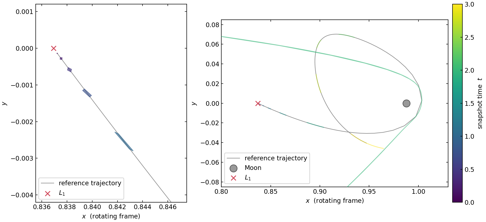
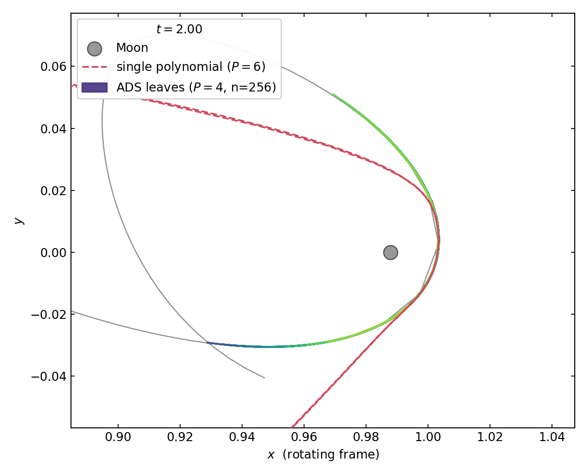
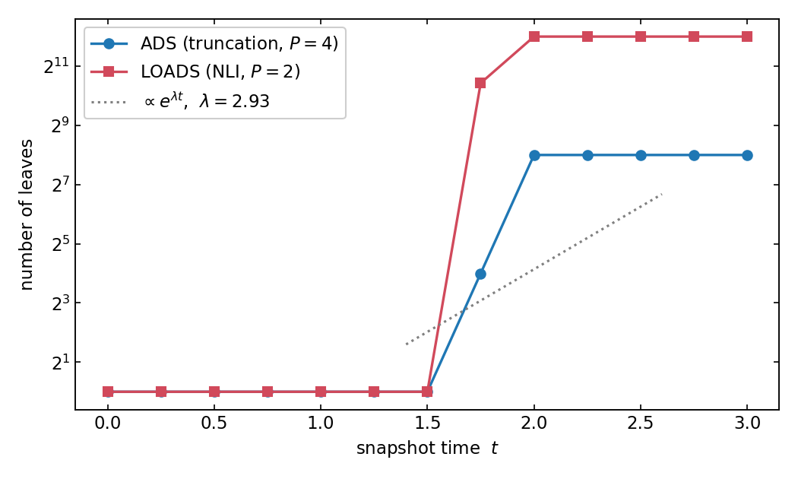

# Three-body problem

This tutorial propagates an IC box sitting on the **unstable manifold of the
Earth–Moon \(L_1\) point** in the planar circular restricted three-body
problem (CR3BP). Unlike the [Kepler tutorial](two_body.md), where the box
deformed through gentle along-track shearing, here the dynamics stretch the
box **exponentially** — the textbook setting for Automatic Domain
Splitting, and the regime it was invented for.

Source: [`examples/three_body/`](https://github.com/andreapasquale94/tax/tree/main/examples/three_body)
— `taylor.cpp`, `ads.cpp`, `loads.cpp`.

## The problem

In the synodic (rotating) frame with the Earth–Moon barycentre at the
origin, lengths scaled by the Earth–Moon distance and time by the system's
rotation rate, the Earth sits at \((-\mu, 0)\) and the Moon at
\((1 - \mu, 0)\) with

$$
\mu = \frac{m_{\text{Moon}}}{m_{\text{Earth}} + m_{\text{Moon}}}
    \approx 0.01215 .
$$

The planar equations of motion for \(\mathbf{s} = (x, y, v_x, v_y)\) are

$$
\begin{aligned}
\dot v_x &= \phantom{-}2 v_y + x
  - (1-\mu)\,\frac{x + \mu}{r_1^3}
  - \mu\,\frac{x - 1 + \mu}{r_2^3}, \\[4pt]
\dot v_y &= -2 v_x + y
  - (1-\mu)\,\frac{y}{r_1^3}
  - \mu\,\frac{y}{r_2^3},
\end{aligned}
$$

with \(r_1, r_2\) the distances to Earth and Moon. The \(\pm 2v\) terms are
the Coriolis force; the \(x, y\) terms the centrifugal force. The same
generic-lambda pattern as before gives one RHS for both `double` and
Taylor-valued states (see `common.hpp`).

## \(L_1\) and its unstable manifold

Between the primaries lies the collinear equilibrium \(L_1\) at
\(x_{L_1} \approx 0.8369\). Linearizing the dynamics there,
\(\delta\dot{\mathbf{s}} = A\, \delta\mathbf{s}\) with

$$
A = \begin{pmatrix}
0 & 0 & 1 & 0 \\
0 & 0 & 0 & 1 \\
1 + 2\sigma & 0 & 0 & 2 \\
0 & 1 - \sigma & -2 & 0
\end{pmatrix},
\qquad
\sigma = \frac{1-\mu}{r_1^3} + \frac{\mu}{r_2^3} \Bigg|_{L_1},
$$

yields a saddle × center spectrum: one **unstable eigenvalue**
\(\lambda \approx 2.93\) with eigenvector \(\mathbf{v}_u\), its stable
mirror \(-\lambda\), and an oscillatory pair. Any displacement with a
component along \(\mathbf{v}_u\) grows like \(e^{\lambda t}\) — doubling
roughly every \(0.24\) time units.

The example computes \(\lambda\) and \(\mathbf{v}_u\) numerically with
`Eigen::EigenSolver` and centers the IC box *slightly off* \(L_1\) along
\(\mathbf{v}_u\):

$$
\mathbf{s}_0 = (x_{L_1}, 0, 0, 0) + 10^{-3}\, \mathbf{v}_u ,
$$

far enough that the entire box lies on the Moon-bound branch of the
unstable manifold — every trajectory in the box escapes toward the Moon.

## A single flow polynomial

Exactly as in the two-body case, we seed a Taylor-valued state on the box
and integrate once:

```cpp
constexpr int P = 6;

tax::ode::IntegratorConfig< double > cfg;
cfg.abstol = cfg.reltol = 1e-13;
cfg.save_steps = true;   // keep every accepted step boundary

auto x0_da = tax::ads::create< P, 4 >( ic_box, icCenter() );
auto sol   = tax::ode::propagate( Verner89{}, rhs(), x0_da, 0.0, /*t_final=*/3.0, cfg );
```



The left panel is the \(L_1\) neighbourhood: the box leaves along the
unstable eigendirection, elongating by \(e^{\lambda t}\) — each snapshot
is visibly longer *and* thinner than the last (the flow is
volume-preserving in position–velocity space, so stretching along
\(\mathbf{v}_u\) is paid for by compression along the stable direction).
The right panel is the full transit: the streak whips around the Moon, and
the \(t = 2.0\) snapshot — exactly at the flyby — fans out into a wide
bulge. That bulge is **not physics**: it is the order-6 polynomial failing,
just as the yellow tail was in the Kepler tutorial, but triggered here by
exponential stretching plus the close approach rather than by accumulated
shear.

## ADS under exponential stretching

Run the same propagation under the truncation criterion
(\(P = 4\), \(\text{tol} = 10^{-4}\), depth \(\le 8\)):

```cpp
const tax::ads::TruncationCriterion criterion{ 1e-4, 8 };

auto tree = tax::ads::propagate< 4 >(
    Verner89{}, criterion, rhs(), ic_box, icCenter(), 0.0, t, cfg, n_threads );
```



At the moment the single polynomial balloons (dashed red), the ADS
partition — 256 leaves, each a low-order polynomial on a tiny slice of the
original box — stays a razor-thin streak wrapped around the flyby arc. This
is the ADS value proposition in one picture: *piecewise* low order beats
*global* high order once the flow is genuinely nonlinear across the domain.

The leaf count tells the same story quantitatively:



Nothing splits while the box is small (\(t \lesssim 1.5\)); once the
stretched box outgrows the polynomial's convergence zone, the leaf count
takes off like the manifold itself (dotted line: \(\propto e^{\lambda t}\))
until the `maxDepth` cap flattens it. LOADS (NLI criterion at \(P = 2\),
depth \(\le 12\)) reacts the same way, two depth levels deeper — its
Jacobian-based index measures the stretching directly, so it needs almost
no polynomial tail to see trouble coming.

!!! tip "Splitting is binary, per axis"
    Each split halves the *normalized* domain along one axis, so after
    \(k\) splits along \(\mathbf{v}_u\)'s dominant axis a leaf covers
    \(2^{-k}\) of the original width — and the stretching eats one depth
    level every \(\ln 2 / \lambda \approx 0.24\) time units. The
    `maxDepth` parameter is therefore a direct budget on *how long* you
    can propagate, not just on memory.

## Run it yourself

```bash
cmake -S . -B build -DTAX_BUILD_EXAMPLES=ON && cmake --build build -j
cd build/examples
./three_body_taylor && ./three_body_ads && ./three_body_loads
python3 ../../examples/plot/plot_three_body.py --data . --out figs
```

Things to try:

- **Flip the manifold branch**: set `kManifoldOffset = -1.0e-3` in
  `common.hpp` and the box escapes toward Earth instead.
- **Shrink the offset** toward the saddle and the box hovers near \(L_1\)
  longer before departing — the leaf-count takeoff shifts right by exactly
  the extra \(e^{\lambda t}\) e-folding time.
- **Compare criteria**: lower the LOADS tolerance and watch it pre-split
  *before* the flyby, where the truncation criterion only reacts once the
  tail mass has already grown.
