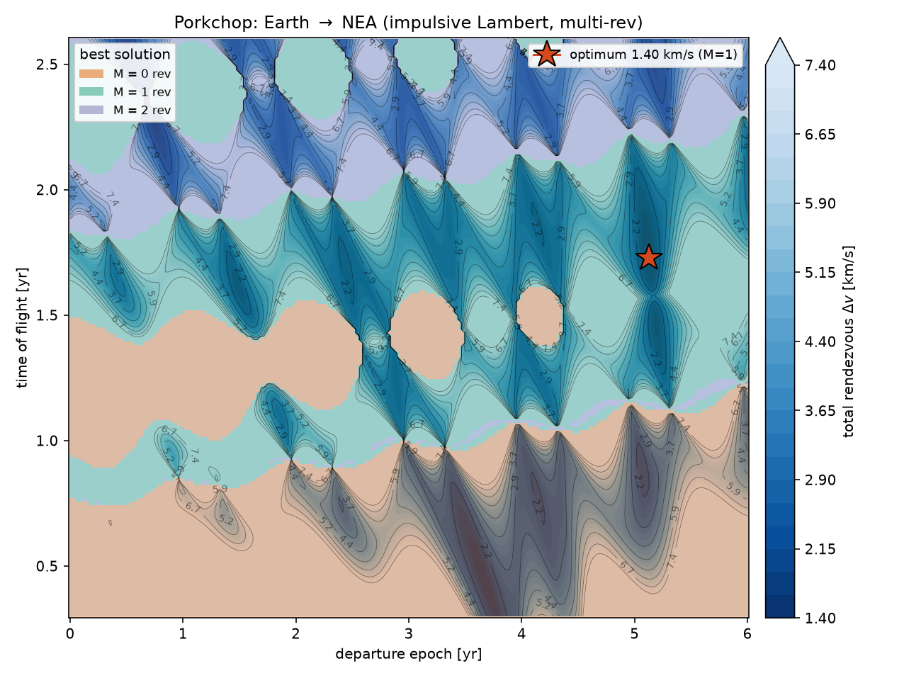
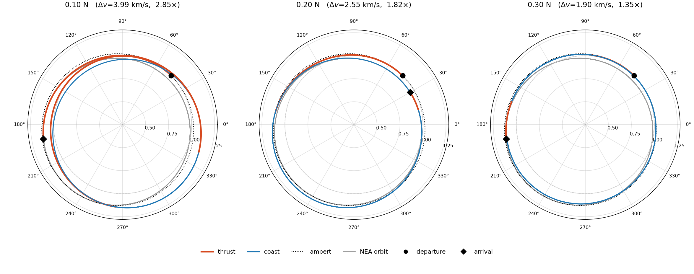
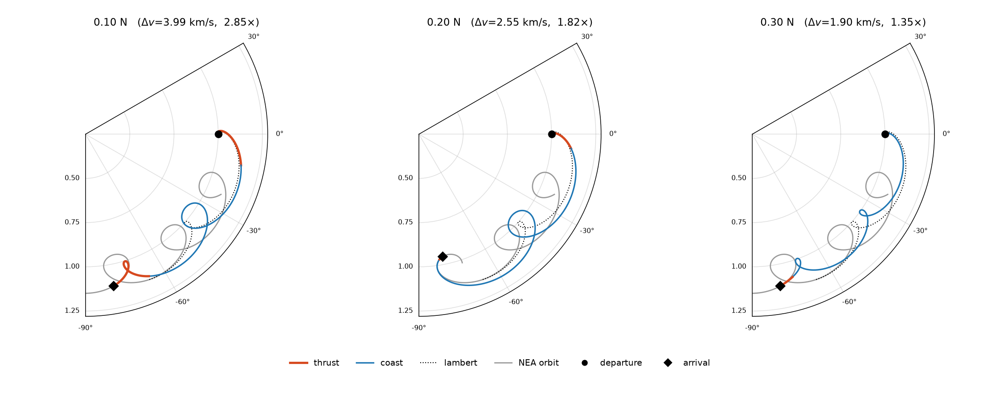
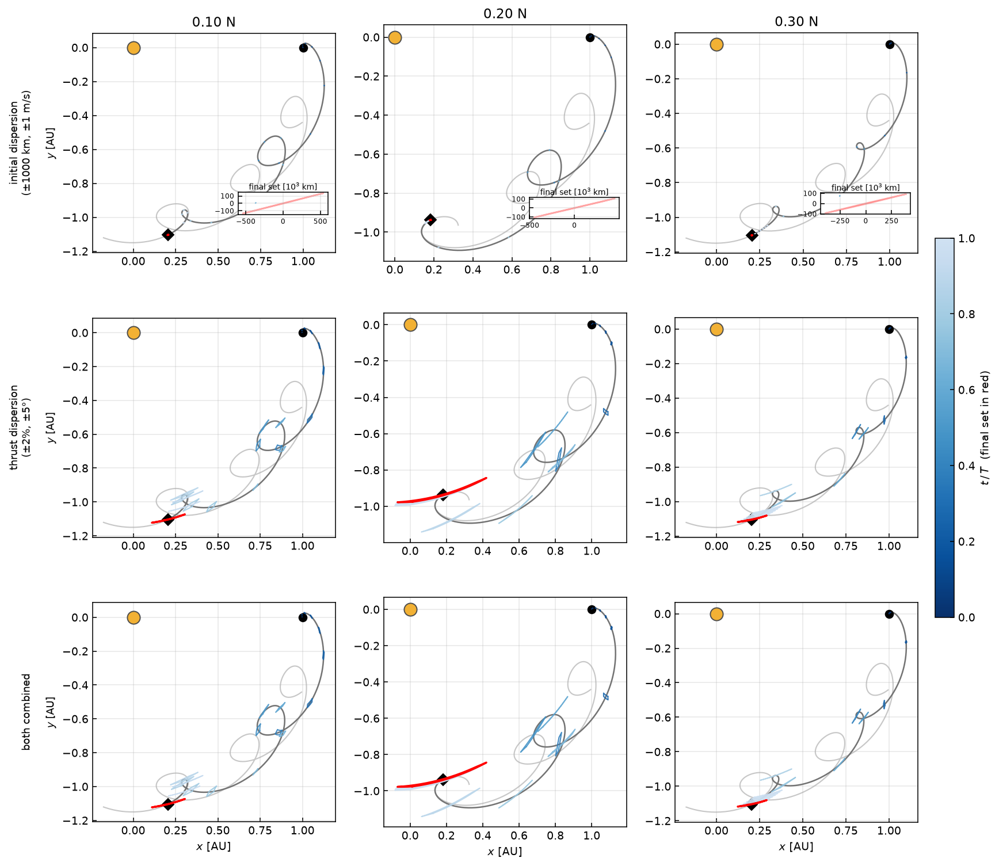

# Dispersion of a low-thrust Earth → NEA transfer

A real interplanetary transfer never starts exactly on its nominal state, and a
low-thrust engine never delivers exactly the commanded acceleration. This
tutorial asks a delivery question: given a designed Earth → near-Earth-asteroid
(NEA) transfer, **where can the spacecraft actually end up?** We carry three
uncertainty sources through the nominal trajectory with a single Differential
Algebra (DA) flow map and read off the **dispersion set** — the image of the
uncertainty box — along the orbit:

1. **initial** navigation error at departure (±1000 km position, ±1 m/s velocity),
2. **thrust** execution error (±2 % magnitude, ±5° pointing), and
3. **both** combined.

The headline result is a clean separation of scales: thrust execution error
dominates the delivery uncertainty by a factor of ~75, while initial navigation
error — though it grows to ~10⁶ km — stays sub-pixel at the scale of the orbit.

Source: [`examples/transfer_dispersion/`](https://github.com/andreapasquale94/tax-flow/tree/main/examples/transfer_dispersion)
— `common.hpp`, `transfer_dispersion.cpp`, `plot.py`, and the preparatory
trajectory-design scripts in `design/`.

---

## 1. Designing the nominal transfer

Everything below propagates uncertainty through *one* fixed trajectory, so we
first design it. This stage is preparatory (Python, `design/`); the DA analysis
only needs its output — the thrust-coast-thrust burn plan.

### Impulsive baseline: a porkchop plot

We work in canonical heliocentric units (\(\mu = 1\), \(1\,\mathrm{DU} = 1\,\mathrm{AU}\),
Earth circular speed \(v_0 = 1\), period \(T = 2\pi = 1\,\mathrm{yr}\)). The
target is an Earth-crossing NEA with \(a = 1.05\,\mathrm{AU}\), \(e = 0.0952\)
(perihelion \(q = 0.95\), aphelion \(Q = 1.15\,\mathrm{AU}\)), argument of
perihelion \(\omega = 50°\); its phase is auto-tuned so a cheap launch window
falls within a few years.

A multi-revolution Lambert solver
([`lamberthub`](https://github.com/jorgepiloto/lamberthub), Izzo 2015) sweeps
departure epoch × time of flight and records the minimum-Δv rendezvous in each
cell. The Blues_r contour is total rendezvous Δv; the categorical overlay marks
the winning revolution number \(M\).



The optimum is a **single-revolution** (\(M=1\)) transfer at
\(\Delta v_\text{imp} = 1.40\;\mathrm{km/s}\), departing at \(t \approx 5.13\,\mathrm{yr}\)
with a \(1.73\,\mathrm{yr}\) flight time. This is the impulsive reference the
low-thrust penalty is measured against.

### Finite-burn low-thrust transcription

Each impulse becomes a finite, **constant-inertial-direction** burn. The plan is
**thrust → coast → thrust**: a burn of duration \(\tau_1\) along direction
\(\phi_1\), a ballistic coast, then a burn of duration \(\tau_2\) along
\(\phi_2\), arriving on the NEA state. For a given thrust level the four
parameters \((\tau_1, \phi_1, \tau_2, \phi_2)\) are solved with a Newton method
(`fsolve`) over a flight-time search so that the spacecraft truly rendezvouses
(position **and** velocity match). The acceleration magnitude is set by the
thrust-to-mass ratio,

$$
a_\text{lt} = \frac{F}{M_\text{sc}\,(\mu/r_0^2)},
\qquad \mu/r_0^2 = 5.9301\times10^{-3}\;\mathrm{m\,s^{-2}},
$$

so a 1000 kg spacecraft at 0.10 / 0.20 / 0.30 N gives
\(a_\text{lt} = 0.0169 / 0.0337 / 0.0506\). The excess over the impulsive
optimum is the low-thrust penalty:

| Thrust | \(a_\text{lt}\) | \(\Delta v\) [km/s] | penalty | transfer \(T\) [yr] |
|---|---|---|---|---|
| 0.10 N | 0.0169 | 3.99 | 2.85× | 2.62 |
| 0.20 N | 0.0337 | 2.55 | 1.82× | 2.18 |
| 0.30 N | 0.0506 | 1.90 | 1.35× | 2.62 |

Lower thrust must burn longer and farther from the impulsive geometry, so it
pays a larger penalty. The three transfers, inertial frame (thrust arcs red,
coast blue, impulsive Lambert dotted, NEA grey):



and in the Sun–Earth **rotating** frame (Earth fixed at the right), which makes
the burn-coast-burn structure and the spiral-out to the NEA orbit legible:



The burn parameters printed by the design scripts are the `Preset` constants in
`common.hpp` — the nominal plan the dispersion analysis propagates through.

---

## 2. The dispersion problem

### One DA state for every uncertainty

All three uncertainty sources are carried by a single **six-dimensional** state
that appends the two thrust-execution errors as zero-dynamics components:

$$
\mathbf{s} = \bigl(\delta_m,\;\delta_\theta,\;x,\;y,\;v_x,\;v_y\bigr),
\qquad D = 6.
$$

On an arc with commanded magnitude \(m_\text{arc}\) (either \(a_\text{lt}\) on a
burn or \(0\) on a coast) and commanded inertial direction \(\phi_\text{arc}\),
the realised acceleration is perturbed by the (constant) execution errors,

$$
\boxed{\;
\mathbf{a} = (1+\delta_m)\,m_\text{arc}\,
\bigl(\cos(\phi_\text{arc}+\delta_\theta),\;\sin(\phi_\text{arc}+\delta_\theta)\bigr),
\;}
$$

giving the equations of motion

$$
\dot\delta_m = 0,\quad \dot\delta_\theta = 0,\quad
\dot x = v_x,\quad \dot y = v_y,
$$
$$
\dot v_x = -\frac{x}{r^3} + (1+\delta_m)\,m_\text{arc}\cos(\phi_\text{arc}+\delta_\theta),
\qquad
\dot v_y = -\frac{y}{r^3} + (1+\delta_m)\,m_\text{arc}\sin(\phi_\text{arc}+\delta_\theta),
$$

with \(r = (x^2+y^2)^{1/2}\). On a coast (\(m_\text{arc}=0\)) the thrust terms
vanish and the execution errors have no effect — exactly as expected.

### Three cases = three boxes

Each case is just a choice of box half-widths on the same state; a zero
half-width axis simply does not disperse:

| Case | \(\delta_m\) | \(\delta_\theta\) | position | velocity |
|---|---|---|---|---|
| initial | — | — | ±1000 km | ±1 m/s |
| thrust  | ±2 % | ±5° | — | — |
| both    | ±2 % | ±5° | ±1000 km | ±1 m/s |

In canonical units ±1000 km \(= 6.7\times10^{-6}\) and ±1 m/s
\(= 3.4\times10^{-5}\), tiny relative to the \(\mathcal{O}(1)\) state — yet they
do not stay tiny.

---

## 3. Method: the DA flow map as a surrogate

### Seeding and arc-by-arc composition

`ads::create<P,M>` turns the box into a vector of degree-\(P\) Taylor
polynomials in the \(M=6\) expansion variables, with axis \(i\) mapped to state
component \(i\):

```cpp
constexpr int P = 4, M = 6;
auto x = tax::ads::create<P, M>(dispBox(disp_case), stateIC());
// x(2), x(3) are now Taylor polynomials x(δ), y(δ) over the box
```

The flow map is carried **arc by arc**: the integrator propagates the
Taylor-valued state through each constant-`(m_arc, phi_arc)` ODE, and passing
the output as the next arc's input composes the arc flow maps automatically —
no explicit composition operator is needed.

```cpp
for (const auto& arc : arcs) {                 // thrust, coast, thrust
    const double dt = arc.dur / arc.nsub;
    for (int k = 0; k < arc.nsub; ++k) {
        auto sol = tax::ode::propagate(Verner89{},
                       rhs(arc.mag, arc.phi), x, t, t + dt, cfg);
        x = sol.x.back();
        t += dt;
        record(t);                             // snapshot the dispersion set
    }
}
```

### From polynomial to dispersion set

At any snapshot the physical position
\(\bigl(x(\boldsymbol\delta),\,y(\boldsymbol\delta)\bigr)\) is a degree-4
polynomial valid over the whole box. Evaluating it over the box gives the
**dispersion set** — the reachable region of delivery points — at negligible
cost compared with an integration:

- **thrust / both:** the dispersion is driven by the 2-D
  \((\delta_m, \delta_\theta)\) face, so the set boundary is the **image of that
  face's perimeter**. Sampling the unit square's edge and evaluating the
  polynomial traces the true set outline (a thin, curved 2-D region) exactly —
  no convex hull, which would otherwise short-circuit across the curve.
- **initial:** the dispersion fills a 4-D position/velocity box; its planar
  shadow is recovered as the **convex hull** of a vertex + interior sample
  cloud.

### Is order 4 enough? A saturation check

A polynomial surrogate is only trustworthy if it has not *saturated* — if order
\(P\) still resolves the nonlinear stretching over the box. The example checks
this directly: for 16 random box points it compares the DA evaluation against a
full nonlinear re-integration from the corresponding perturbed initial state.
The worst-case position error is

| Level | initial | thrust | both |
|---|---|---|---|
| 0.10 N | 0.0001 km | 220 km | 297 km |
| 0.20 N | 0.0000 km | 3645 km | 4936 km |
| 0.30 N | 0.0000 km | 80 km | 94 km |

— at most ~0.03 % of the ~75 × 10⁶ km thrust set. The degree-4 flow map is an
accurate surrogate; the sets below are physical, not artefacts of truncation.

---

## 4. Results

Each panel shows the transfer in the Sun–Earth rotating frame for one thrust
level (columns) and one uncertainty case (rows). Dispersion sets are drawn at
21 snapshots as time-coloured outlines (blue early → light late), with the final
set in red; the Sun is the gold dot, Earth the black circle, the NEA arrival the
diamond, and the NEA orbit grey.



**Thrust dispersion dominates.** The thrust and both rows show a clear
**funnel**: the set is a point at departure and grows monotonically to
\(\sim0.5\,\mathrm{AU}\) (\(\sim75\times10^{6}\,\mathrm{km}\)) at arrival. A
constant ±2 % / ±5° execution error, integrated over a multi-year transfer,
maps to a large, elongated delivery set — elongated because magnitude and
pointing errors perturb the along-track energy far more than cross-track.

**Initial dispersion is small but not negligible.** At AU scale the initial-only
row looks empty, so each panel carries a km-scale inset of its final set: ±1000 km
/ ±1 m/s navigation error blows up to a delivery set \(\sim0.8\text{–}1.1\times10^{6}\,\mathrm{km}\)
across — large in absolute terms, yet **~75× smaller** than the thrust set and
hence sub-pixel against the orbit.

**Both ≈ thrust.** The combined row is visually indistinguishable from the
thrust row: the two sources add in quadrature, so the ~75× larger thrust set
swamps the initial-navigation contribution. For this mission, **delivery
accuracy is governed by thrust-execution quality, not by initial knowledge.**

A practical reading: tightening the navigation budget below ~1000 km / ~1 m/s
buys almost nothing at arrival, whereas calibrating the engine's magnitude and
pointing is the lever that actually shrinks the delivery ellipse.

---

## Run it yourself

```bash
cmake -S . -B build -DTAXFLOW_BUILD_EXAMPLES=ON && cmake --build build -j
cd build/examples

./transfer_dispersion low     # → transfer_dispersion_low.json   (~1.3 s)
./transfer_dispersion med     # → transfer_dispersion_med.json
./transfer_dispersion high    # → transfer_dispersion_high.json

python3 ../../examples/transfer_dispersion/plot.py \
    transfer_dispersion_low.json transfer_dispersion_med.json \
    transfer_dispersion_high.json --out transfer_dispersion.png
```

To regenerate or retarget the nominal transfer itself, see
`examples/transfer_dispersion/design/` (Python; `pip install numpy scipy
matplotlib lamberthub`).

### Things to try

- **Re-budget the uncertainty.** Halve `kPos`/`kVel` or `kSigM`/`kSigTheta` in
  `common.hpp` and watch which row of the figure actually moves — a quick
  sensitivity study on where to spend engineering margin.
- **Raise the DA order.** Set `P = 6` to capture more of the nonlinear
  stretching near arrival; the saturation-check column should shrink further.
- **Retarget the transfer.** Change the NEA elements or thrust levels in
  `design/`, rerun the three scripts, and copy the new `Preset` constants into
  `common.hpp`.
- **Add more snapshots.** Lower `kCloudEvery` (or raise the per-arc `nsub`) for
  a finer funnel at the cost of a larger JSON.

See the [missed-thrust dispersion tutorial](missed_thrust.md) for the
statistical (1/2/3σ) counterpart of this set-valued analysis, and the
[low-thrust reachability tutorial](reachability.md) for expanding the *control*
rather than the state.
