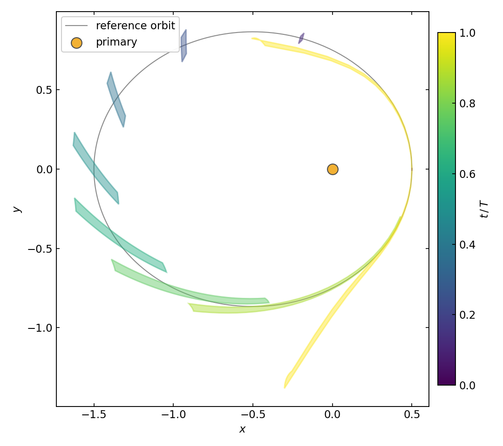
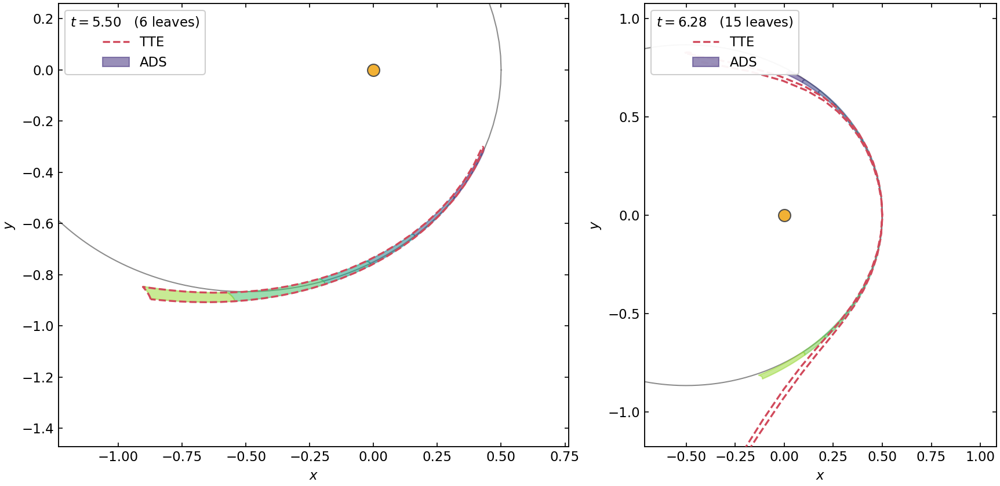
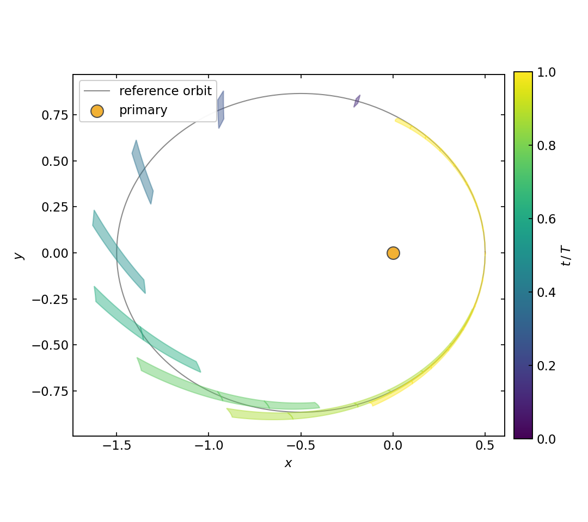
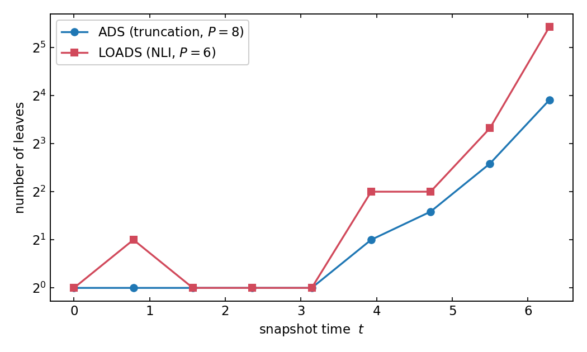

# Two-body problem

This tutorial propagates an entire **box of initial conditions** around one
revolution of an eccentric Kepler orbit — in a *single* numerical
integration. The trick is to integrate Taylor expansions instead of numbers:
the result is a polynomial **flow map** that can be evaluated anywhere in the
box. We then see where one polynomial stops being accurate, and how
[Automatic Domain Splitting](../ode/index.md) (ADS) fixes that by
partitioning the box.

Source: [`examples/two_body/`](https://github.com/andreapasquale94/tax/tree/main/examples/two_body)
— `taylor.cpp`, `ads.cpp`, `loads.cpp`.

## The problem

The planar two-body (Kepler) problem in canonical units (\(GM = 1\)):

$$
\ddot{\mathbf{r}} = -\frac{\mathbf{r}}{r^3},
\qquad
\mathbf{r} = (x, y), \quad r = \sqrt{x^2 + y^2}.
$$

As a first-order system in the state \(\mathbf{s} = (x, y, v_x, v_y)\):

$$
\dot{x} = v_x, \qquad
\dot{y} = v_y, \qquad
\dot{v}_x = -\frac{x}{r^3}, \qquad
\dot{v}_y = -\frac{y}{r^3}.
$$

The reference initial condition sits at the **periapsis** of an
\(e = 0.5\) ellipse with semi-major axis \(a = 1\):

$$
x_0 = a(1 - e) = 0.5,
\qquad
v_{y,0} = \sqrt{\frac{1 + e}{1 - e}} = \sqrt{3},
$$

and one orbital period is \(T = 2\pi\). In code, the right-hand side is a
generic lambda — the *same* callable serves both `double`-valued states and
Taylor-valued states, because `TaylorExpansion` overloads the arithmetic
operators and the math functions:

```cpp
inline auto rhs()
{
    return []( const auto& s, const auto& /*t*/ )
    {
        using S       = std::decay_t< decltype( s ) >;
        const auto x  = s( 0 );
        const auto y  = s( 1 );
        const auto r2 = x * x + y * y;
        const auto r3 = r2 * sqrt( r2 );    // r^3 = r^2 * r

        S out;
        out( 0 ) =  s( 2 );      // dx/dt  = vx
        out( 1 ) =  s( 3 );      // dy/dt  = vy
        out( 2 ) = -x / r3;      // dvx/dt = -x/r^3
        out( 3 ) = -y / r3;      // dvy/dt = -y/r^3
        return out;
    };
}
```

## One polynomial for a whole box

Instead of a single point, take a small box around the reference IC: a
center \(\mathbf{s}_0\) and a half-width vector \(\mathbf{h}\), here varying
only the \(y\) position (\(\pm 8 \times 10^{-3}\)) and the \(y\) velocity
(\(\pm 2 \times 10^{-2}\)). Seed every state component as a degree-1
polynomial in the normalized displacement
\(\xi \in [-1, 1]^4\):

$$
s_i(\xi) = s_{0,i} + h_i\, \xi_i .
$$

Propagating this Taylor-valued state through the integrator carries *all*
partial derivatives of the flow up to the truncation order \(P\) along for
the ride. The solution at time \(t\) is the **flow polynomial**

$$
\Phi_t(\xi)
  = \sum_{|\alpha| \le P} c_\alpha(t)\, \xi^\alpha ,
$$

a polynomial map that sends any point of the IC box to its propagated
state. The whole pipeline is four lines:

```cpp
constexpr int P = 6;   // truncation order
constexpr int M = 4;   // number of expansion variables

auto x0_da = tax::ads::create< P, M >( ic_box, icCenter() );   // s0 + h.*xi
auto sol   = tax::ode::propagate< /*Dense=*/true >(
    Verner89{}, rhs(), x0_da, 0.0, t_final, cfg );

// evaluate the flow polynomial anywhere in the box, at any time:
double x_img = sol( t )( 0 ).eval( xi );   // xi in [-1,1]^4
```

`Dense=true` stores the continuous extension, so `sol(t)` interpolates the
polynomial flow map at *any* time, not just at step boundaries.

To visualize the map, we trace the boundary of the box's \((y, v_y)\)-face
and evaluate the \((x, y)\) components of \(\Phi_t\) along it at nine
snapshot times:



Reading the figure: the box starts as a sliver at periapsis \((0.5, 0)\),
gets sheared into a "banana" as the orbit progresses (trailing edge moves
slower near apoapsis), and by \(t = 2\pi\) (yellow) the **single polynomial
has broken down** — the spurious tail near the bottom is the order-6
polynomial extrapolating where the truncated expansion no longer converges.
The dominant physical effect is *along-track shearing*: a velocity
variation changes the orbital period, so the set keeps stretching along the
orbit every revolution.

## Automatic Domain Splitting

ADS ([Wittig et al. 2015](https://doi.org/10.1007/s10569-015-9618-3))
monitors the polynomial during propagation and **splits the domain in two**
whenever the expansion stops converging, re-expanding each half on its own
sub-box. The split criterion is the *truncation mass*: with the graded-lex
coefficient layout, the order-\(P\) terms are the polynomial's tail block,
and

$$
\varepsilon_P
  = \sum_{|\alpha| = P} \left| c_\alpha \right|
  \; > \; \mathrm{tol}
$$

signals that the series is no longer decaying. The split direction is the
variable \(j\) contributing the most to that mass
(\(\sum_{|\alpha|=P} |c_\alpha|\, \alpha_j\)). The API mirrors
`ode::propagate`:

```cpp
const tax::ads::TruncationCriterion criterion{ /*tol=*/1e-6, /*maxDepth=*/8 };

auto tree = tax::ads::propagate< P >(
    Verner89{}, criterion, rhs(), ic_box, icCenter(), 0.0, t, cfg, n_threads );

for ( int li : tree.done() )
{
    const auto& leaf = tree.leaf( li );      // leaf.box, leaf.depth
    // leaf.payload = flow polynomial valid on leaf.box
}
```

The result is a *tree of boxes*, each carrying its own flow polynomial that
is accurate on its own sub-domain:



At \(t = 5.50\) (left) six leaves cover the banana; the single polynomial
(dashed) still roughly agrees but already bulges at the tip. At
\(t = 2\pi\) (right) the single polynomial shoots off through the bottom of
the frame, while the 15 ADS leaves stay glued to the true set through the
periapsis re-passage — the most nonlinear part of the orbit.

The ADS partition over the full orbit looks as follows — each snapshot is colored
by $t / T$, showing how the leaf count (and leaf size) evolves through the orbit:



## LOADS: splitting on the nonlinearity index

The truncation criterion needs a moderately high order (here \(P = 8\)) to
have a meaningful tail to measure. **LOADS**
([Losacco, Fossà & Armellin 2024](https://doi.org/10.2514/1.G007271))
instead estimates nonlinearity from the *Jacobian* of the polynomial map —
the ratio of the nonlinear mass of \(\partial \Phi / \partial \xi\) to its
linear part — which works at much lower orders:

```cpp
const tax::ads::NliCriterion criterion{ /*tol=*/1.0, /*maxDepth=*/6 };
```



Both criteria react to the same physics — nothing happens for half an
orbit, then subdivisions ramp up through the periapsis re-passage — but
they trade order against leaf count: LOADS at \(P = 6\) splits earlier and
ends with more leaves than truncation-ADS at \(P = 8\).

## Run it yourself

```bash
cmake -S . -B build -DTAX_BUILD_EXAMPLES=ON && cmake --build build -j
cd build/examples
./two_body_taylor && ./two_body_ads && ./two_body_loads
python3 ../../examples/plot/plot_two_body.py --data . --out figs
```

Things to try:

- **Grow the box** (`kIcBoxHalfWidth` in `examples/two_body/common.hpp`) and
  watch the single polynomial fail earlier and the leaf count rise.
- **Raise the order `P`** in `taylor.cpp` — the single polynomial survives
  longer, at a steep cost: the number of coefficients is
  \(\binom{P + 4}{4}\) per state component.
- **Tighten `tol`** in the ADS criterion to trade accuracy against leaves.

Next: the [three-body problem](three_body.md), where the stretching is
exponential and splitting becomes a matter of *when*, not *if*.
