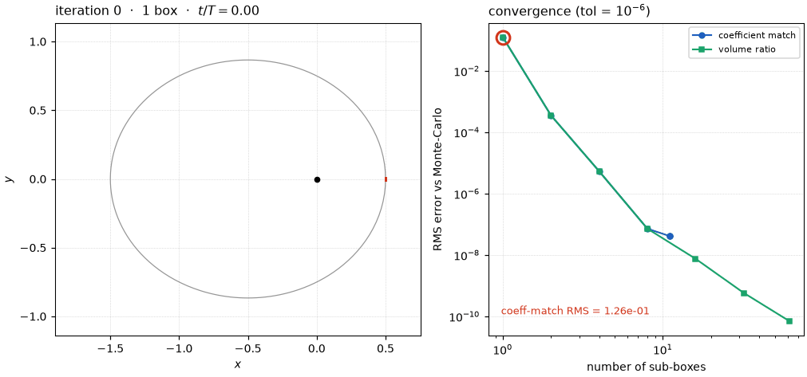
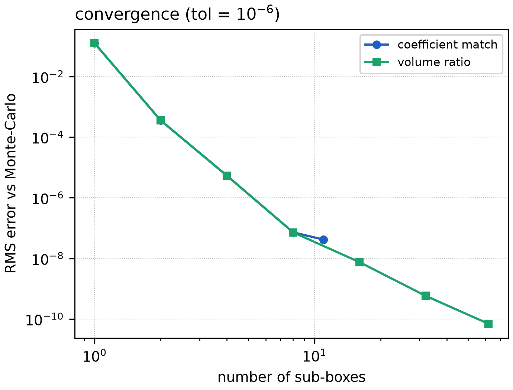
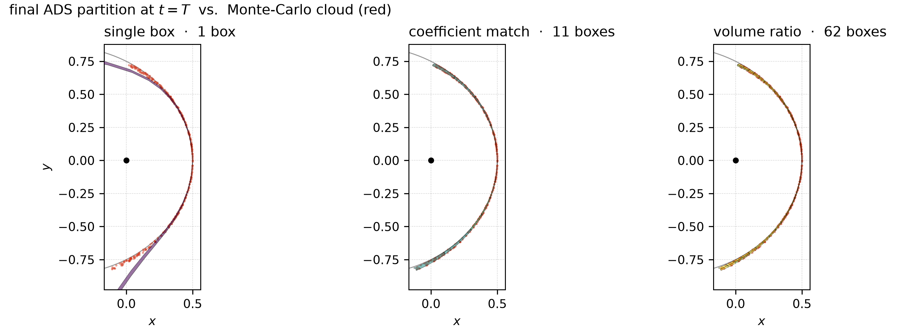
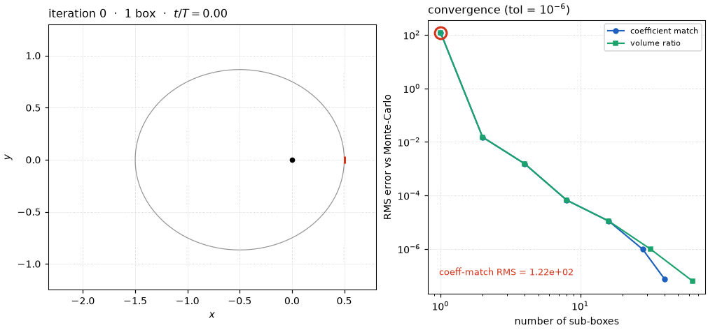
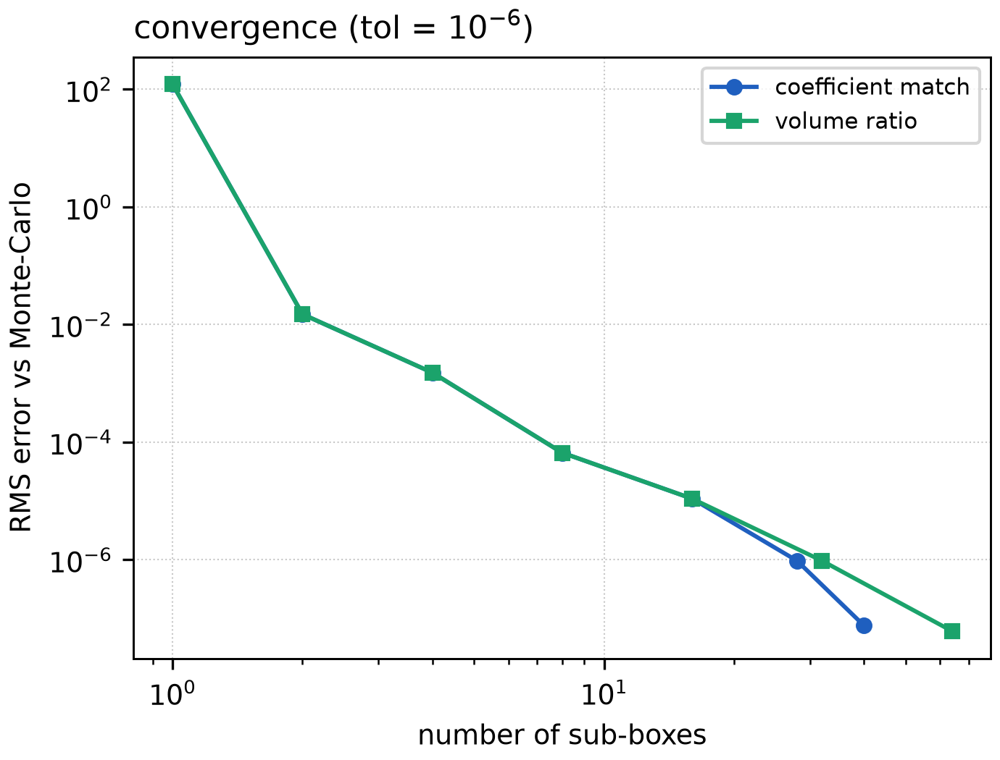
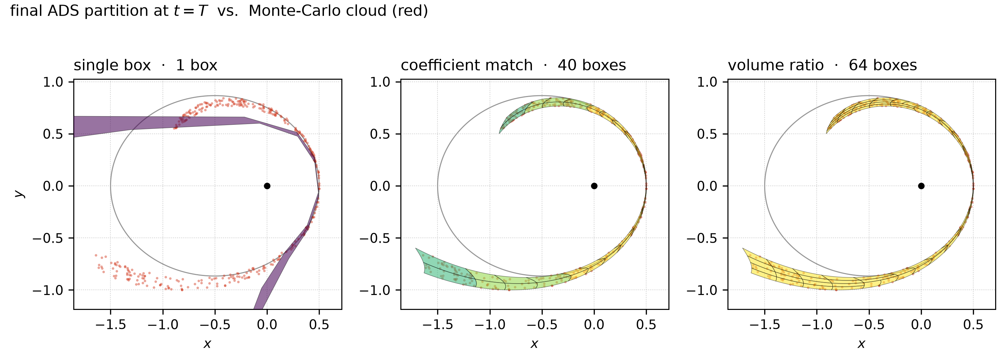

# Parallel ADS by refinement

The [two-body tutorial](two_body.md) showed *classic* Automatic Domain
Splitting: the integrator watches the flow polynomial as it advances and, the
moment the expansion stops converging, **splits the box in flight** and
resumes each half from the split time. It is accurate and frugal, but it is
also *sequential in time* — a box cannot be subdivided until the integration
has reached the point where it goes bad, and each child inherits its parent's
partial state.

This tutorial takes the opposite tack, implemented in
[`tax::ads::refine`](https://github.com/andreapasquale94/tax/tree/main/include/tax/ads/refine.hpp):

> **Always propagate the whole box to the final time first. Only then judge
> its quality — and if it is poor, split the *initial conditions* and try
> again.**

Because every box is carried to `t_final` on its own, with no dependence on
any other box's partial state, the entire refinement is **embarrassingly
parallel**: a box and all of its eventual descendants are independent
propagations that fan out across a thread pool.

It runs on the **same IC box** as the [taylor.cpp / ads.cpp](two_body.md)
examples — varying the initial \(y\) position (\(\pm 8\times10^{-3}\)) and
\(y\) velocity (\(\pm 2\times10^{-2}\)) of the \(e=0.5\) Kepler orbit — so the
figures here line up directly with those.

Source: [`examples/two_body/refine.cpp`](https://github.com/andreapasquale94/tax/tree/main/examples/two_body/refine.cpp)
and [`plot_refine.py`](https://github.com/andreapasquale94/tax/tree/main/examples/two_body/plot_refine.py).

## The idea

Start from one box of initial conditions and propagate it to `t_final`,
yielding a single flow polynomial \(\Phi\). Now ask a sharp question:

> *Does splitting this box change the answer?*

To answer it, bisect the box along some direction, propagate **both halves**
all the way to `t_final` as well, and compare the two children
\(\Phi_L, \Phi_R\) against the parent \(\Phi\). If they agree, the parent was
already faithful — keep it. If they disagree, the parent had drifted past its
radius of convergence — discard it, keep the children, and recurse the same
test on each. Repeat until every surviving box passes, or a maximum depth is
reached.

```cpp
#include <tax/ads.hpp>
#include <tax/ode.hpp>
using namespace tax::ode::methods;

tax::ads::Box< double, 4 > ic_box{ ic_center, half_width };   // (y, vy) active

auto tree = tax::ads::refine< /*P=*/6 >(
    Verner89{},
    tax::ads::CoefficientMatchCriterion{ /*tol=*/1e-6, /*maxDepth=*/8 },
    rhs, ic_box, ic_center, /*t0=*/0.0, /*t1=*/2 * M_PI, cfg, /*n_threads=*/8 );

for ( int li : tree.done() )
{
    const auto& leaf = tree.leaf( li );   // leaf.box, leaf.depth, leaf.payload
}
```

The return type is the same `AdsTree` the classic driver produces, so
everything downstream (point lookup, the merger, the I/O helpers) works
unchanged. The difference is purely *how* the tree was grown.

### Refinement vs. classic ADS

| | Classic ADS (`propagate`) | Refinement (`refine`) |
|---|---|---|
| When a box is split | mid-integration, at the failure time | after a full propagation to `t_final` |
| Child initial state | parent's partial map at the split time | fresh identity on the child sub-box |
| Quality probe | one flow map, inspected in flight | parent **vs. its two children** at `t_final` |
| Cost per box | one integration | three (self + two trial children) |
| Parallelism | independent boxes only | the **whole recursion** fans out |

Refinement deliberately spends more arithmetic — every box pays for two trial
children even if it is ultimately accepted — to buy a propagation pattern with
no time-ordering constraints at all.

## What quality index?

By the time we judge a box, three flow maps already exist: the parent \(\Phi\)
and its two trial children \(\Phi_L, \Phi_R\), each propagated to `t_final`. A
quality index boils the question *"does splitting change the answer?"* down to
a single number that measures how much \(\Phi\) **disagrees** with the pair
\((\Phi_L, \Phi_R)\). Small disagreement → the parent was already faithful,
accept it; large → it overreached, keep the children and recurse.

Why is comparing against the children a sound test? Because each child
re-expands its Taylor series on **half** the domain, where the series converges
faster, it is a strictly *more accurate* model of the flow there than the
parent is. So the parent-vs-children gap is essentially a direct readout of the
parent's **truncation error** — exactly the quantity ADS exists to control. A
split is "worth it" precisely when the more-accurate children tell a different
story from the parent.

Two indices ship in
[`refine_criteria.hpp`](https://github.com/andreapasquale94/tax/tree/main/include/tax/ads/refine_criteria.hpp).
Both choose the same split *direction* — the coordinate carrying the most
order-\(P\) coefficient mass — and differ only in **how they measure the
disagreement**.

### Coefficient match — compare the polynomials

The most direct measure compares the maps term by term. The snag is that parent
and child speak different coordinates: a child's \(\xi' \in [-1,1]^m\) spans
only half of the parent's box. So first rewrite the parent in the child's
coordinates, using the *very same* affine substitution a split applies,

$$
\xi_d \;\to\; \pm\tfrac12 + \tfrac12\,\xi'_d
\qquad (-\ \text{left half},\;\; +\ \text{right half}),
$$

giving \(\Phi\!\restriction_{\text{half}}\) — the parent "as seen from" the
child's sub-box. Were the parent exact, this restriction would reproduce the
independently propagated child *exactly*; whatever gap remains is the parent's
error. The index is the largest such gap, over every state component \(i\) and
both halves, normalised by the child's own magnitude:

$$
\delta \;=\; \max_i \;
  \frac{\big\| \Phi^{(i)}\!\restriction_{\text{half}} - \Phi^{(i)}_{\text{child}} \big\|_\infty}
       {\big\| \Phi^{(i)}_{\text{child}} \big\|_\infty} .
$$

`CoefficientMatchCriterion` accepts when \(\delta \le \texttt{tol}\), so here
`tol` is a **relative coefficient error**. It needs no geometry and works in
any dimension — the default choice.

### Volume ratio — compare the size of the image

The idea that originally motivated this experiment is geometric: a diverged
polynomial draws a *badly shaped* image, so measure the **size of the set** the
box maps to and check whether splitting changes it. The image of the box face
is an \(m\)-dimensional surface in state space; the factor by which the map
stretches a small patch of domain onto that surface is
\(\sqrt{\det(J^\top J)}\), where \(J = \partial\Phi/\partial\xi\) is the
Jacobian (for a square \(J\), just \(|\det J|\)). Integrating that local stretch
over the box gives the image's \(m\)-volume,

$$
V \;=\; \int_{[-1,1]^m} \sqrt{\det\!\big(J^\top J\big)}\,\mathrm{d}\xi
  \;\approx\; \frac{2^m}{n^m}\!\!\sum_{\text{grid }\xi}\!\sqrt{\det\!\big(J^\top J\big)},
$$

evaluated on a small \(n\)-point-per-axis grid. The decisive property is that
the two children's domains **exactly tile** the parent's, so an *accurate*
parent obeys \(V(\Phi) = V(\Phi_L) + V(\Phi_R)\). The verdict is therefore how
far that bookkeeping is off:

$$
\rho \;=\; \frac{V(\Phi)}{V(\Phi_L) + V(\Phi_R)} ,
\qquad \text{accept when } |\rho - 1| \le \texttt{tol},
$$

so for this index `tol` is a **relative change in set volume**. Stretching or
folding past the radius of convergence inflates or mis-sizes the parent's
volume and pushes \(\rho\) off 1; because \(|\det|\) never cancels — a fold
counts its area twice rather than to zero — the measure stays honest even for
inside-out maps, an advantage over a signed projected area. For two active axes
\(V\) is simply an **image area**, so `VolumeRatioCriterion` is the
dimension-general form of the original "compare the final area" idea: point its
`axes` at the active box dimensions (here \(\{1,3\}\) for \((y, v_y)\)) and it
works for any state-space dimension.

### Which to use

Run the refinement with each index in turn (both at `tol = 1e-6`) and a clear
picture emerges. Since they share the split *direction*, they make **identical
splits early on** and ride the very same RMS-vs-box-count curve — neither is
"more accurate per box". They part ways only near convergence, because `tol`
means a different thing to each: a relative coefficient error stops sooner than
a relative volume change of the same size. On the small box the coefficient
match is satisfied at **11 boxes** while the (stricter) volume ratio keeps
subdividing to **62**:

| | coefficient match | volume ratio |
|---|---|---|
| boxes per iteration | 1, 2, 4, 8, **11** | 1, 2, 4, 8, 16, 32, **62** |
| final RMS vs. Monte Carlo | \(4.2\times10^{-8}\) | \(6.9\times10^{-11}\) |

Reach for the **coefficient match** as a cheap, dimension-free default; reach
for the **volume ratio** when you specifically want to bound the growth of the
reachable *set* — its `tol` is a statement about volume, the natural currency
for uncertainty propagation and reachability. The example drives the animation
with the coefficient match and runs the volume ratio alongside for comparison.

## Watching it converge

The example sweeps the depth cap \(k = 0, 1, 2, \dots\): iteration 0 is the
single box, and each iteration adds a level of refinement until the partition
stops changing. At every iteration we push every sub-box to `t_final`, draw the
box images along the orbit, and score the piecewise-polynomial prediction
against a 350-point **Monte-Carlo** reference cloud.



Iteration 0 — the lone box — breaks down: by one full period the order-6
polynomial is extrapolating past where it converges, its image folds in on
itself, and the RMS error against Monte Carlo is \(\sim\! 0.13\) (the same
breakdown the single polynomial shows in the [two-body tutorial](two_body.md)).
Two boxes already cut that to \(3.6\times10^{-4}\); each further level
concentrates new splits where the orbit is most nonlinear (the periapsis
re-passage) and the partition closes onto the true set.

The matching improves monotonically with the number of sub-boxes — exactly the
behaviour we want from a refinement scheme — and both quality indices trace the
same curve (right panel of the animation):



| iteration | sub-boxes | RMS vs. Monte Carlo |
|----------:|----------:|--------------------:|
| 0 | 1  | \(1.3\times10^{-1}\) |
| 1 | 2  | \(3.6\times10^{-4}\) |
| 2 | 4  | \(5.3\times10^{-6}\) |
| 3 | 8  | \(7.2\times10^{-8}\) |
| 4 | 11 | \(4.2\times10^{-8}\) |

## Converged regions vs. Monte Carlo

Comparing the **final-time region** each method settles on makes the difference
plain. Below, the converged partition of every method at \(t = T\) is drawn over
the Monte-Carlo cloud (red): the single polynomial bulges away from the true set
at the periapsis tip (its order-6 image has run past its radius of convergence),
while both refinement criteria tile the set tightly — coefficient match with 11
boxes, the stricter volume ratio with 62 (boxes coloured by refinement depth).



Both refined partitions cover the true set; they differ only in granularity at
this tolerance, exactly as the convergence curves predict.

## A bigger box: many more sub-boxes

Tripling the IC box (\(\pm 2.4\times10^{-2}\) in \(y\), \(\pm 6\times10^{-2}\) in
\(v_y\)) makes the set far more nonlinear, and the refinement responds by
fragmenting much further. The single polynomial is now hopeless — its
prediction misses the Monte-Carlo cloud by an RMS of \(\sim\!120\) — while the
box count climbs past its small-box value by roughly fourfold (the example
re-runs with `./two_body_refine 3 refine_big.json`):

| iteration | 0 | 1 | 2 | 3 | 4 | 5 | 6 |
|---|--:|--:|--:|--:|--:|--:|--:|
| coefficient-match boxes | 1 | 2 | 4 | 8 | 16 | 28 | **40** |
| volume-ratio boxes | 1 | 2 | 4 | 8 | 16 | 32 | **64** |
| RMS (coeff. match) | \(1.2{\times}10^{2}\) | \(1.5{\times}10^{-2}\) | \(1.5{\times}10^{-3}\) | \(6.6{\times}10^{-5}\) | \(1.1{\times}10^{-5}\) | \(9.6{\times}10^{-7}\) | \(7.6{\times}10^{-8}\) |



The two indices again make the same early splits and ride the same RMS curve;
here neither has converged by depth 6, so both keep subdividing — coefficient
match to 40 boxes, the stricter volume ratio to 64:



And the final partitions still wrap the true set tightly where the single
polynomial sprays across the frame:



## Parallelism

Each box is propagated independently of every other, so `refine` runs the
recursion across `num_threads` workers pulling from a shared queue: the
expensive three propagations happen lock-free on copied-out inputs, and the
mutex guards only the queue and the tree mutation. Because the accept/split
decision for a box depends solely on that box and its two trial children — never
on global ordering — the resulting partition is **identical** whether run on one
thread or many (leaves are canonicalised by box center), which the test suite
checks directly.

### Runtime vs. classic ADS

[`benchmarks/bench_ads_refine.cpp`](https://github.com/andreapasquale94/tax/tree/main/benchmarks/bench_ads_refine.cpp)
times both strategies on the bigger box (\(P = 6\), depth ≤ 6) across 1–4
worker threads. Indicative wall-clock on a 4-core machine (median of three):

| method | leaves | 1 thread | 2 | 3 | 4 | speed-up |
|---|--:|--:|--:|--:|--:|--:|
| classic ADS (truncation) | 52 | 877 ms | 444 | 307 | 233 | 3.8× |
| refine (coefficient match) | 40 | 4562 ms | 2360 | 1674 | 1365 | 3.3× |
| refine (volume ratio) | 64 | 6047 ms | 3120 | 2234 | 1773 | 3.4× |

Two things stand out. First, all three scale to roughly \(3.3\text{–}3.8\times\)
on four cores — including classic ADS, whose in-flight splits still leave plenty
of independent boxes to run concurrently. Second, refinement is several times
more expensive in absolute terms: it carries *every* box to `t_final` and pays
for two trial children at each node, where classic ADS stops each box at its
split time and reuses the parent's partial state. Refinement spends that compute
to buy a propagation pattern with no time-ordering constraints — useful when the
per-box propagation is itself farmed out (clusters, GPUs) or when you want the
final-time accuracy guarantee the comparison gives for free. The volume ratio
adds the Jacobian-quadrature cost on top, so it is the priciest per box.

### Aggressive multi-way splitting

`refine`'s `split_dirs` parameter (default 1) can split the top-\(k\) directions
at once into \(2^k\) children — a more aggressive subdivision meant to reach the
partition in fewer rounds. On this problem it does **not** pay off:

| variant | 1 thread | leaves | RMS vs. MC |
|---|--:|--:|--:|
| binary (`split_dirs = 1`) | 5.8 s | 40 | \(2.3\times10^{-7}\) |
| 4-way (`split_dirs = 2`) | 5.0 s | 64 | \(5.7\times10^{-5}\) |

The 4-way run is marginally faster per call but **over-refines**: it splits both
axes equally, so it cannot do the *anisotropic* refinement the binary version
uses to pour boxes into the one direction — the along-track shear — that actually
needs them. The result is more boxes *and* worse accuracy. Binary bisection wins
here; the multi-way option is there for problems whose nonlinearity is genuinely
isotropic.

### Order vs. leaf count (classic ADS)

A separate trade-off governs classic ADS: raising the expansion order \(P\) lets
each box cover more of the set, so fewer boxes are needed — but every propagation
is costlier (the coefficient count is \(\binom{P+4}{4}\) per component). On the
bigger box (one thread, `maxDepth = 8`):

| criterion | \(P = 2\) | \(P = 4\) | \(P = 6\) |
|---|--:|--:|--:|
| truncation — leaves | 256\* | 216 | 78 |
| truncation — time | 0.27 s | 0.84 s | 1.5 s |
| NLI — leaves | 256\* | 256\* | 256\* |
| NLI — time | 0.23 s | 1.7 s | 9.4 s |

(\* hit the depth cap). Low order needs many small boxes; high order needs few
big ones but pays for the bigger polynomials — a sweet spot sits in the middle.
NLI keeps splitting aggressively at every order, so its cost climbs steeply with
\(P\).

## Run it yourself

```bash
cmake -S . -B build -DTAX_BUILD_EXAMPLES=ON && cmake --build build -j
cd build/examples
./two_body_refine                       # small box (comparable to ads.cpp)
./two_body_refine 3 refine_big.json     # bigger box (×3 half-widths)
python3 ../../examples/two_body/plot_refine.py --data . --out figs
python3 ../../examples/two_body/plot_refine.py --data . --json refine_big.json \
        --suffix _big --out figs
```

`two_body_refine [scale] [outfile]` scales the IC half-widths by `scale`
(default 1) and writes `outfile` (default `refine.json`).

Things to try:

- **Switch the index.** The example drives the animation with
  `CoefficientMatchCriterion`; swap in
  `VolumeRatioCriterion{ 1e-6, k, {1, 3}, 8 }` (the two active axes) to refine
  on the geometric set-volume instead.
- **Grow the box** (`kIcBoxHalfWidth` in `examples/two_body/common.hpp`) and
  watch the single polynomial fail harder and the converged leaf count climb.
- **Set `TAX_ADS_THREADS`** and confirm the partition (and every coefficient) is
  bit-for-bit independent of the worker count.
