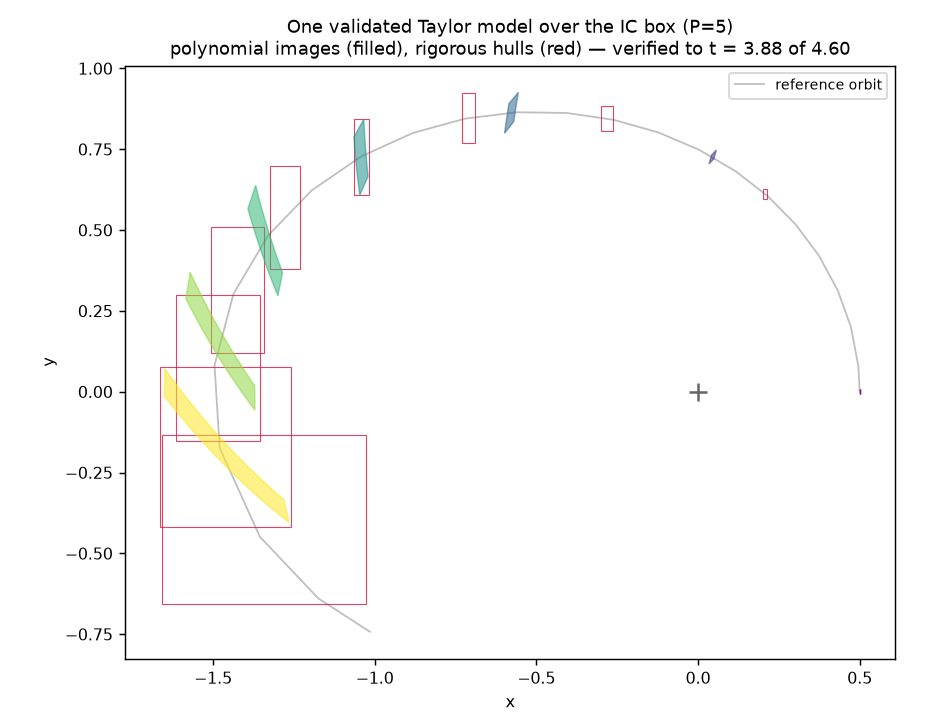
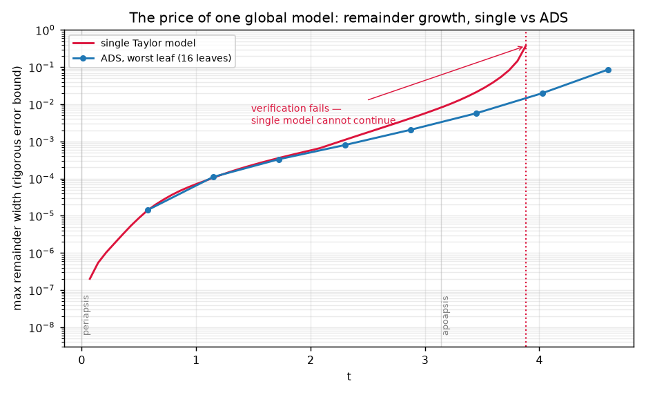
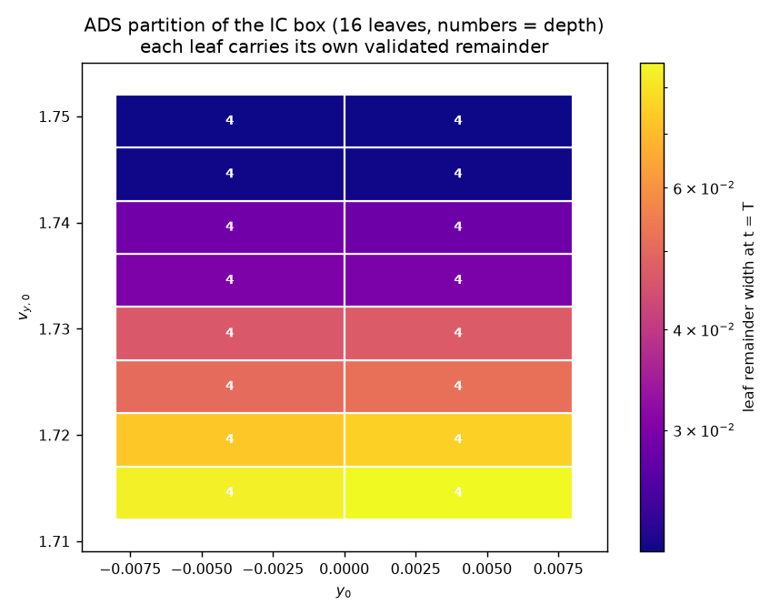
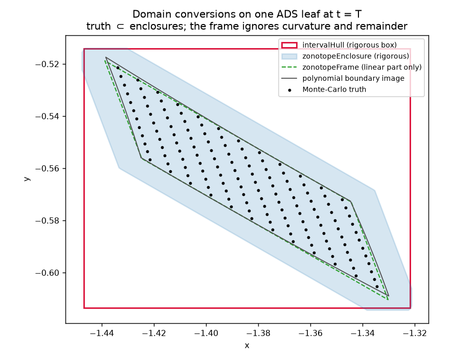

# Two-body problem with validated Taylor models

The [two-body tutorial](two_body.md) propagated a whole box of initial
conditions through one Kepler orbit as a *polynomial* flow map — accurate, but
with no statement about **how** accurate. This tutorial repeats the journey
with **Taylor models**: polynomial flow maps that carry a rigorous remainder
interval, so every result is a mathematically *guaranteed enclosure* of the
true flow. Along the way we meet all three layers of the integration:

1. the validated **`tax::ode`** stepper (`methods::Picard`),
2. **`tax::domain`** conversions (`createModel`, interval hulls, zonotope
   enclosures),
3. **`tax::ads`** over Taylor-model payloads — and why splitting is not
   optional here.

Source: [`examples/two_body/taylor_model.cpp`](https://github.com/andreapasquale94/tax-flow/blob/main/examples/two_body/taylor_model.cpp)
— plots with `examples/plot/plot_two_body_taylor_model.py`.

*Requires a `tax` core that ships the `tax::model` module (Taylor models with
rigorous remainder bounds). Everything here compiles only when
`<tax/model.hpp>` is available.*

## From polynomials to enclosures

A Taylor model is a pair \((P, I)\): a polynomial plus a remainder interval,
with the contract

$$
f(\xi) \;\in\; P(\xi) + I
\qquad \text{for all } \xi \in [-1, 1]^M .
$$

Every arithmetic operation propagates both parts with outward rounding, so
the contract survives arbitrary compositions — including an entire ODE
integration. Where the classic `create` seeds a `TaylorExpansion` state,
`createModel` seeds the identity Taylor-model state with **zero remainder**:

```cpp
constexpr int P = 5;                     // Taylor-model order
const auto ic_box = icBox();             // y0 ± 8e-3, vy0 ± 2e-2 at periapsis

using TM    = tax::model::TaylorModel<double, P, 4>;
using State = Eigen::Matrix<TM, 4, 1>;

State s = tax::domain::createModel<P>(ic_box, icCenter());
```

The right-hand side is the *same generic lambda* as ever — Taylor models
overload `sqrt`, `/`, `*`, … — with one practical tweak: compute `1/r³` once
and multiply, rather than dividing twice:

```cpp
const auto r2     = x * x + y * y;
const auto inv_r3 = 1.0 / (r2 * sqrt(r2));
out(2) = -1.0 * x * inv_r3;
out(3) = -1.0 * y * inv_r3;
```

## Act 1 — one validated model around the orbit

`methods::Picard` selects the Taylor-model stepper. Each step *lifts* the
state into an extra time variable \(\tau \in [t, t+h]\), builds the step flow
by Picard iteration with the `tax::model` antiderivation, and — this is the
validated part — **verifies** that one more Picard application maps the
candidate remainder set into itself. By the Schauder fixed-point theorem the
true flow then lies inside the enclosure. If verification fails, the step is
rejected and \(h\) halves.

```cpp
auto sol = tax::ode::propagate(tax::ode::methods::Picard{}, rhs(), s, t0, t1, cfg);
```



The filled polygons are the images of the IC-box boundary under the
*polynomial* part — the familiar deforming banana. New are the red
rectangles: rigorous **interval hulls** (`tax::domain::intervalHull`) of the
enclosure, polynomial range bound *plus* remainder. Early in the orbit they
hug the polygons; as the set stretches, the gap between polygon and hull is
exactly the rigorously-bounded model error.

And the run does not finish. Watch the remainder:



The remainder (red) grows exponentially along the orbit — every step sweeps
the polynomial's uncovered truncation into the interval, and the stretching
flow amplifies what is already there. Just past apoapsis the enclosure
becomes so wide that the Picard remainder map stops being contractive at any
step size; verification fails and the stepper rejects until the integrator
gives up, at \(t \approx 3.85\) of the \(2\pi\) period. **A single
validated model cannot even reach the periapsis return.** This is not a
weakness of the implementation; it is the honest price of a guaranteed error
bound. (The classic `TaylorExpansion` run in the
[two-body tutorial](two_body.md) "completes" the same orbit — silently
degrading near periapsis, as its Monte-Carlo validation shows.)

## Act 2 — ADS makes rigor scale

Automatic Domain Splitting fixes exactly this failure mode. The same call
shape as the classic pipeline — only the method tag changes:

```cpp
auto sol = tax::ads::propagate<P>(
    tax::ode::methods::Picard{},
    tax::ads::TruncationCriterion{3e-5, 10},
    rhs(), ic_box, icCenter(), 0.0, /*t1=*/4.6, cfg);
```

When a leaf's polynomial **truncation frontier** exceeds tolerance, the leaf
splits: the polynomial parts are re-identified on each half
(`ξ → ±½ + ½ξ′`) and — the crucial bit — the parent's remainder carries over
*unchanged and still valid*, because each child's cube maps into a subset of
the parent's domain. Each child then continues with its own, much smaller
truncation error.

One Taylor-model detail: a propagated payload's degree-\(P\) block is
*structurally empty* — the antiderivation sweeps it into the remainder every
step — so the criterion reads the top **two** degrees (the frontier sits at
\(P-1\)). The remainder itself is validated integration error, not
splittable structure; a custom criterion may key on it directly via
`state(i).remainder()`.



The blue curve in the remainder figure above tells the story: the ADS run
sails past the point where the single model died and completes the target
horizon \(t = 4.6\) — periapsis to apoapsis and most of the way back — with
every leaf still verified. Splitting is what makes validated integration
*scale*: each split cuts the leaf's truncation mass by \(\sim 2^{P-1}\),
which is exactly the term feeding the remainder.

One honest caveat, measured rather than hidden: the **full** \(e = 0.5\)
revolution is out of reach at this box size no matter how finely ADS splits.
The remainder a leaf has already accumulated is *inherited* by its children,
and the interval (box) transport of that remainder suffers the classic
**wrapping effect** through the periapsis return — the amplification is
multiplicative and split-independent. The literature's remedy (shrink
wrapping / preconditioned remainders, Makino & Berz) belongs in a future
`tax::model` iteration.

The partition also shows *where* rigor is expensive: leaves are finest along
the direction that controls the periapsis passage — the same anisotropy the
classic ADS run discovers, now with a per-leaf certificate attached.

### Rigorous evaluation

`AdsSolution::evaluate` returns **interval enclosures** for Taylor-model
payloads: locate the leaf that owns an initial condition, evaluate its
polynomial at the exact factor coordinates, add the remainder. The example
closes the loop with a Monte-Carlo containment sweep — a lattice of initial
conditions, each propagated by an independent scalar integrator:

```cpp
const auto enc   = sol.evaluate(ic);          // vector of tax::model::Interval
const auto truth = scalarReference(ic, T);
assert(enc && (*enc)(i).contains(truth(i)));  // holds for every sample
```

Every sampled true flow lies inside its leaf's enclosure — the property the
entire pipeline exists to deliver, checked end-to-end.

## Act 3 — domain conversions

An enclosure is only useful if you can hand it to the next tool. The
`tax::domain` bridge converts a Taylor-model state into every set
representation of the module — here for the leaf that owns the box center,
at the final time:

```cpp
auto hull  = tax::domain::intervalHull(payload, {0, 1});       // rigorous Box
auto zen   = tax::domain::zonotopeEnclosure(payload, {0, 1});  // rigorous zonotope
auto frame = tax::domain::zonotopeFrame(payload);              // linear part only
auto pz    = tax::domain::toPolynomialZonotope(payload);       // drops remainder!
```



Reading from the inside out:

- the **Monte-Carlo truth cloud** (black dots) and the **polynomial boundary
  image** (grey) — the actual set, to graphical accuracy;
- the **zonotope enclosure** (blue) — the even-exponent construction on the
  polynomial coefficients, plus one axis-aligned generator per remainder:
  rigorous and much tighter than the box;
- the **interval hull** (red) — the loosest rigorous representation;
- the **zonotope frame** (green, dashed) — the *exact linear part*: not an
  enclosure at all (it ignores curvature and remainder), useful as a local
  frame, e.g. for [reorientation](../domain/zonotope.md).

`toPolynomialZonotope` completes the round trip back into the
[`PolynomialZonotope`](../domain/polynomial_zonotope.md) domain — with the
remainders **dropped** (debug-asserted zero), so use it for geometry, not for
certificates.

## What doesn't carry over

Two operations refuse Taylor-model payloads at compile time, each with the
rationale at the call site:

- **`merge()`** — un-splitting would extrapolate a child's polynomial onto
  the full parent domain, where the child's remainder bound does not hold.
  A rigorous merge needs re-verification, which the merge pass does not do.
- **`refine()`** — the propagate-then-assess driver is `TaylorExpansion`-
  specific.

## Numbers

With the defaults in the example (`P = 5`, box `y0 ± 8·10⁻³`,
`vy0 ± 2·10⁻²`, `e = 0.5`, horizon `T = 4.6` ≈ 73 % of the period):

| | single Taylor model | ADS (`tol = 3·10⁻⁵`) |
|---|---|---|
| reaches `T = 4.6` | **no** — verification fails at `t ≈ 3.85` | **yes** (16 leaves, depth ≤ 4) |
| wall-clock | ~10 s (incl. the capped death) | ~5 s on 4 threads |
| Monte-Carlo containment | — | every located sample inside its enclosure |

Run it yourself:

```bash
cmake -S . -B build -DTAXFLOW_BUILD_EXAMPLES=ON
cmake --build build --target two_body_taylor_model
./build/examples/two_body_taylor_model
python3 examples/plot/plot_two_body_taylor_model.py taylor_model.json
```
